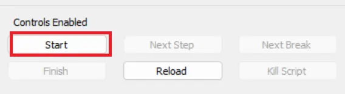

## Purpose

This solution is designed to monitor the Windows Cluster Shared volume, create tickets if the cluster volume space falls below 10%, and perform audits to maintain a report of the cluster disk spaces on the Hyper-V Cluster servers.

## Auditing Content

| Content                                                                 | Type     | Function                                                                                                           |
|-------------------------------------------------------------------------|----------|--------------------------------------------------------------------------------------------------------------------|
| [Script - Windows Cluster Volume Space Audit [DV]](/docs/cbd9495c-f2a7-44f1-9f84-55cfa1ac1490) | Script   | This script is created to audit the Cluster group devices to maintain a report of the free space on the cluster disks. |
| [Dataview - Windows Cluster Volume Space Audit [Script]](/docs/99dc53c5-ca74-4988-815a-0a1ad3fad8eb) | Dataview | This dataview is built to show the cluster disk space audit report fetched from the table "pvl_cluster_volumes," where the script [CWA Script - Windows Cluster Volume Space Audit](/docs/cbd9495c-f2a7-44f1-9f84-55cfa1ac1490) performs the audit. |

## Automation Content

| Content                                                                 | Type          | Function                                                                                                           |
|-------------------------------------------------------------------------|---------------|--------------------------------------------------------------------------------------------------------------------|
| [Remote Monitor - Windows Cluster Shared Volume Detection](/docs/a0ee778f-854b-4c86-aa0f-192a09019fe3) | Remote Monitor | This monitor detects the cluster volumes where the cluster disk space is below 10% as an error and between 10% and 20% as a warning. |
| [Script - Windows Cluster Shared Volume [Autofix,Ticket]](/docs/0a795741-52b7-4de6-abc2-01b5add80f99) | Script        | This function script runs as an autofix with the remote monitor [Windows Cluster Shared Volume Detection](/docs/a0ee778f-854b-4c86-aa0f-192a09019fe3) to create a ticket with detailed information about the cluster disk where the free space is below the threshold. It also calls the script [CWA Script - Windows Cluster Volume Space Audit](/docs/cbd9495c-f2a7-44f1-9f84-55cfa1ac1490) to perform the space audit after the autofix script is scheduled to ensure the latest data is captured for that cluster server. |
| **△ CUSTOM - Execute Script - Windows Cluster Shared Volume**           | Alert Template | This alert template is designed to run the autofix script [Script - Windows Cluster Shared Volume](/docs/0a795741-52b7-4de6-abc2-01b5add80f99) with the remote monitor [Remote Monitor - Windows Cluster Shared Volume Detection](/docs/a0ee778f-854b-4c86-aa0f-192a09019fe3). |
 
## Additional Content

| Content                                                                 | Type          | Function                                                                                                           |
|-------------------------------------------------------------------------|---------------|--------------------------------------------------------------------------------------------------------------------|
| [Import - Remote Monitor - Windows Cluster Shared Volume Detection](/docs/2fee5750-3a75-4256-b1b6-fcf2b81dccd6) | Import Content | This content assists in importing the remote monitor using the provided query.                                    |
| [CWA Custom Table - pvl_cluster_volumes](/docs/746629d0-d1de-4a90-840d-135cf1063776) | Table         | The purpose of this table is to store the audit report of the cluster disk space on the Hyper-V cluster servers.   |

## Implementation

### Auditing

1. Import the following content using the ProSync Plugin:
   - [Script - Windows Cluster Volume Space Audit [DV]](/docs/cbd9495c-f2a7-44f1-9f84-55cfa1ac1490)
   - [Dataview - Windows Cluster Volume Space Audit [Script]](/docs/99dc53c5-ca74-4988-815a-0a1ad3fad8eb)

2. Reload the system cache:

   

3. Configure the Audit script by following the steps below:
   - Navigate to Automation -> Scripts.
   - Open the script "Windows Cluster Volume Space Audit [DV]" and click debug.
   - Select any random client and computer.
   - Set the value of the Set_Environment Parameter to 1 and click OK.
   
   - Once the debugger screen opens, click Start and Finish.
   
   
   - Once the script completes successfully, click OK.

4. Reload the system cache:

   

5. Navigate to Browse -> Groups -> _System Automation -> Cluster Detected. Launch it by double-clicking on it.
   
   Navigate to Computers -> Scheduled Scripts.
   It should show the schedule of the "Windows Cluster Volume Space Audit [DV]" script:
   

### Alerting

1. Import the following content using the ProSync Plugin:
   - [Script - Windows Cluster Shared Volume [Autofix,Ticket]](/docs/0a795741-52b7-4de6-abc2-01b5add80f99)
   - Follow the [Import - Remote Monitor - Windows Cluster Shared Volume Detection](/docs/2fee5750-3a75-4256-b1b6-fcf2b81dccd6) documentation to create the remote monitor [Remote Monitor - Windows Cluster Shared Volume Detection](/docs/a0ee778f-854b-4c86-aa0f-192a09019fe3).
   - Alert Template - △ CUSTOM - Execute Script - Windows Cluster Shared Volume.

2. Reload the system cache:

   

3. Configure the solution as outlined below:
   - Navigate to Browse -> Groups -> _System Automation -> Cluster Detected.
   - Double-click the Cluster Detected group -> Computers -> Remote Monitors -> Windows Cluster Shared Volume Detection
     - Set up with alert template `△ CUSTOM - Execute Script - Windows Cluster Shared Volume`.

> **Note:** The autofix [Script - Windows Cluster Shared Volume [Autofix,Ticket]](/docs/0a795741-52b7-4de6-abc2-01b5add80f99) also calls the [Script - Windows Cluster Volume Space Audit [DV]](/docs/cbd9495c-f2a7-44f1-9f84-55cfa1ac1490) whenever the cluster volume space is detected below 20% as a warning or below 10% as an error. This maintains the fresh audit report for the volumes we need to monitor closely.