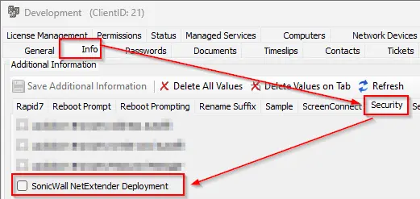
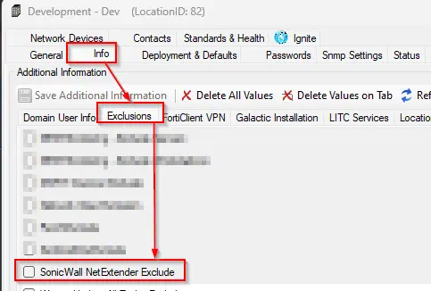
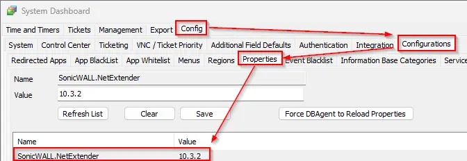
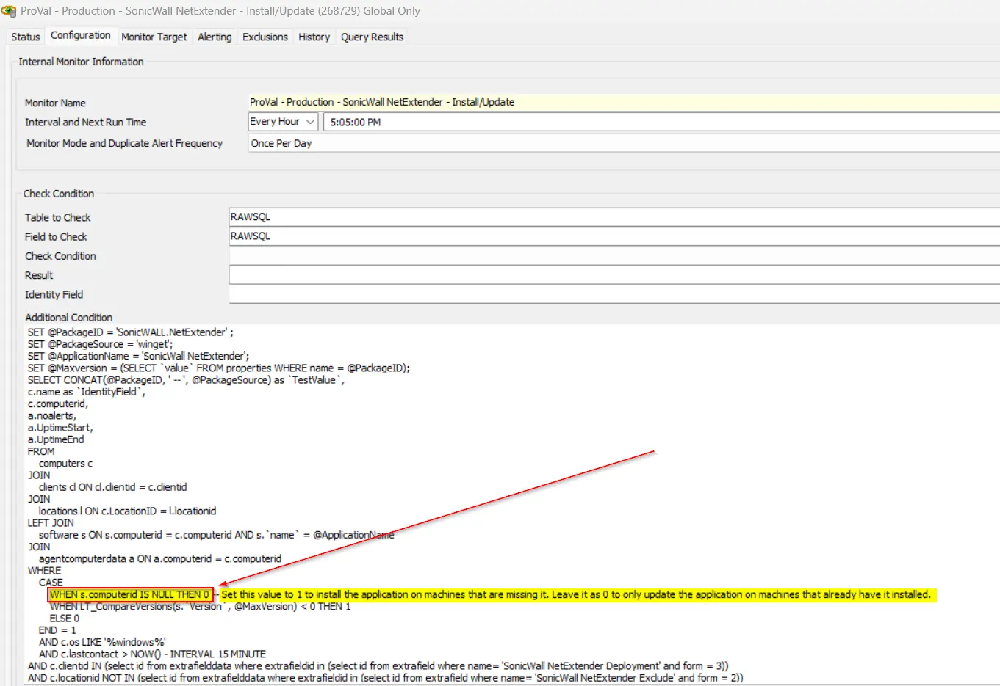

## Purpose

This document provides a comprehensive guide on installing and updating the SonicWall NetExtender application. It includes associated scripts, internal monitors, and alert templates necessary for effective deployment and version detection of SonicWall NetExtender.

## Associated Content

| Content                                                                                      | Type            | Function                                                                                                                                                                                                                                                                                                                                                       |
|----------------------------------------------------------------------------------------------|-----------------|----------------------------------------------------------------------------------------------------------------------------------------------------------------------------------------------------------------------------------------------------------------------------------------------------------------------------------------------------------------|
| [SonicWall NetExtender - Install/Update](/docs/823c8e22-0b24-4cf9-9e25-4048d2973b98) | Script          | This script installs/updates the latest version of the SonicWall NetExtender dynamically.                                                                                                                                                                                                                                        |
| [SonicWall NetExtender - Install/Update](/docs/b0ca57d2-351c-4f1d-9d98-954c1d77777e) | Internal Monitor | This internal monitor detects the online Windows agent where the SonicWall NetExtender is installed for the upgrade. It depends on the client-based EDF 'SonicWall NetExtender Deployment' to check for the deployment. It also relies on the location-based and computer-based EDF 'SonicWall NetExtender Exclude' to exclude particular locations/agents from the deployed clients. To install the SonicWall using this monitor, check the implementation steps.|
| [Application - Latest Version](/docs/ffb77c6c-8dd7-4ca5-82a2-327b1658cbde) | Script          | This script is designed to store the latest version of SonicWall NetExtender in the system properties `SonicWALL.NetExtender`.                                                                                                                                                                                                                         |
| [SonicWall NetExtender - Latest Version Detection](/docs/62ad1299-3e65-4bf7-a415-307fdf9a162c) | Internal Monitor | This monitor schedules the [Script - Application - Latest Version](/docs/ffb77c6c-8dd7-4ca5-82a2-327b1658cbde) to collect the latest version details of the SonicWall NetExtender application every month and update it to the system properties `SonicWall.NetExtender`.                                                                         |
| **△ Custom - Autofix - SonicWall NetExtender - Latest Version Collector**                   | Alert Template   | This alert template runs the script [Application - Latest Version](/docs/ffb77c6c-8dd7-4ca5-82a2-327b1658cbde) for the latest version detection of SonicWall NetExtender and stores it in the system properties. It should be scheduled with the monitor [SonicWall NetExtender - Latest Version Detection](/docs/62ad1299-3e65-4bf7-a415-307fdf9a162c).                     |
| **△ Custom - Autofix - SonicWall NetExtender - Install/Update**                           | Alert Template   | This alert template runs the script [SonicWall NetExtender - Install/Update](/docs/823c8e22-0b24-4cf9-9e25-4048d2973b98) for the SonicWall NetExtender install/update. It should be scheduled with the monitor [SonicWall NetExtender - Install/Update](/docs/b0ca57d2-351c-4f1d-9d98-954c1d77777e).                                            |
| SonicWall NetExtender Deployment                                                              | Client-EDF      | This EDF needs to be checked for the monitor to detect the clients where the SonicWall NetExtender deployment is needed on their agents.                                                                                                                                                                                                |
| SonicWall NetExtender Exclude                                                                 | Location-EDF    | This EDF check at the location level will exclude the agents of the locations from the SonicWall NetExtender deployment.  !                                                                                                                                                                                                                               |
| SonicWall NetExtender Exclude                                                                 | Computer-EDF    | This EDF check will exclude the agents from the SonicWall NetExtender deployment.                        |

## Implementation

1. Import the scripts [SonicWall NetExtender - Install/Update](/docs/823c8e22-0b24-4cf9-9e25-4048d2973b98) and [Application - Latest Version](/docs/ffb77c6c-8dd7-4ca5-82a2-327b1658cbde).
2. Import the internal monitors [SonicWall NetExtender - Install/Update](/docs/b0ca57d2-351c-4f1d-9d98-954c1d77777e) and [SonicWall NetExtender - Latest Version Detection](/docs/62ad1299-3e65-4bf7-a415-307fdf9a162c).
3. Import the alert templates `△ Custom - Autofix - SonicWall NetExtender - Latest Version Collector` and `△ Custom - Autofix - SonicWall NetExtender - Install/Update`.
4. Apply the `△ Custom - Autofix - SonicWall NetExtender - Install/Update` alert template to the [Monitor - SonicWall NetExtender - Install/Update](/docs/b0ca57d2-351c-4f1d-9d98-954c1d77777e).
5. Apply the `△ Custom - Autofix - SonicWall NetExtender - Latest Version Collector` alert template to the [Monitor - SonicWall NetExtender - Latest Version Detection](/docs/62ad1299-3e65-4bf7-a415-307fdf9a162c).
6. Run the [Monitor - SonicWall NetExtender - Install/Update](/docs/b0ca57d2-351c-4f1d-9d98-954c1d77777e). and ensure the script populates the system property.  

   
7. Enable the deployment monitor.
8. The current solution is built for the SonicWall NetExtender update only. If the Install is required then please make the required changes in the monitor as highlighted in the screenshot:

   - Set the value to 1 in the highlighted part of the screenshot to install the application on machines that are missing it. Leave it as 0 to only update the application on machines that already have it installed.

