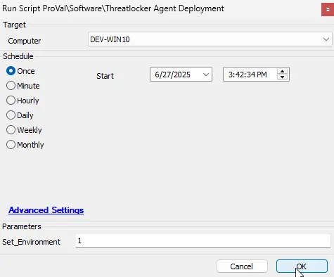
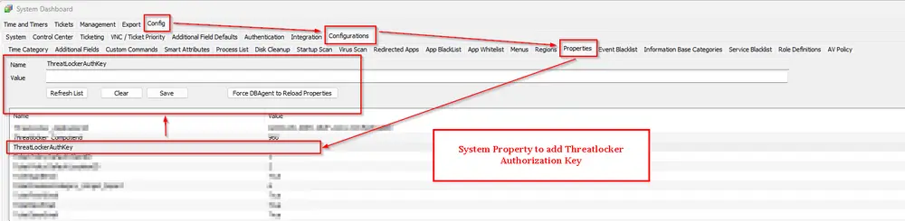
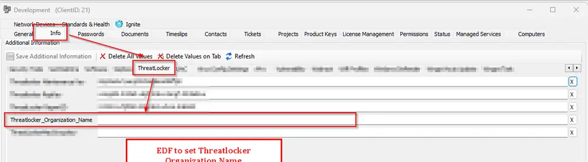
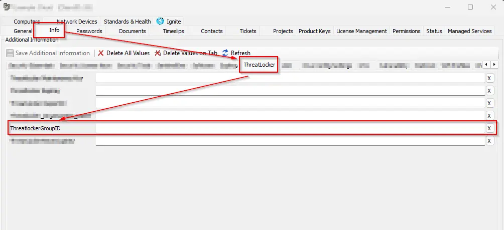
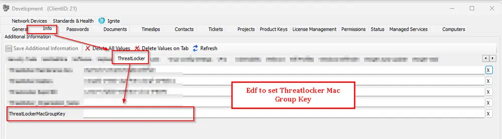

## Purpose

The Purpose of this solution is to deploy a threatlocker agent on both Windows and Mac machines.

## Associated Content

| Content                                                                 | Type             | Function                                                                                                    |
|-------------------------------------------------------------------------|------------------|-------------------------------------------------------------------------------------------------------------|
| [Threatlocker Agent Deployment](/docs/6ee04ebc-5867-4310-a8ed-1f800f031774) | Script           | Deploys Threatlocker agent on both MAC and Windows machines                              |
| [Deploy Threatlocker Agent](/docs/392a41e0-bbe1-4270-87a0-0a093aff3671) | Internal Monitor | Detects machines missing Threatlocker agent                                                                 |
| `△ Custom - Execute Script - Threatlocker Agent Deployment`             | Alert Template   | Executes the [Threatlocker Agent Deployment](/docs/6ee04ebc-5867-4310-a8ed-1f800f031774) on the machines detected by the [Deploy Threatlocker Agent](/docs/392a41e0-bbe1-4270-87a0-0a093aff3671) internal monitor |

## Implementation

### Step 1

Import the following content using the ProSync Plugin:

- **Script:** [Threatlocker Agent Deployment](/docs/6ee04ebc-5867-4310-a8ed-1f800f031774)  
- **Internal Monitor:** [Deploy Threatlocker Agent](/docs/392a41e0-bbe1-4270-87a0-0a093aff3671)  
- **Alert Template:** `△ Custom - Execute Script - Threatlocker Agent Deployment`

### Step 2

Reload the system cache:  

### Step 3

Configure the solution as outlined below:

- Run the script [Threatlocker Agent Deployment](/docs/6ee04ebc-5867-4310-a8ed-1f800f031774) script on any agent by setting the `Set_environment` to `1` in order to create associated system properties.  
  

- Navigate to `Automation` --> `Monitors` within the CWA Control Center and setup the following:
  - [Internal Monitor - ProVal - Production - Deploy Threatlocker Agent](/docs/392a41e0-bbe1-4270-87a0-0a093aff3671)  

    - Apply `△ Custom - Execute Script - Threatlocker Agent Deployment` alert template on the monitor  
    - Right-click and Run Now to start the monitor

### Step 4

**For Windows Deployment:**

- Enter the Threatlocker Authorization key in System Properties under system property `ThreatLockerAuthKey`
- Enter the Organization name in Client EDF `Threatlocker_Organization_Name`
- Enter the Threatlocker Group ID in Client EDF `ThreatlockerGroupID`

  

**For MAC Deployment:**

- Enter Threatlocker Mac in Client EDF `ThreatLockerMacGroupKey`

