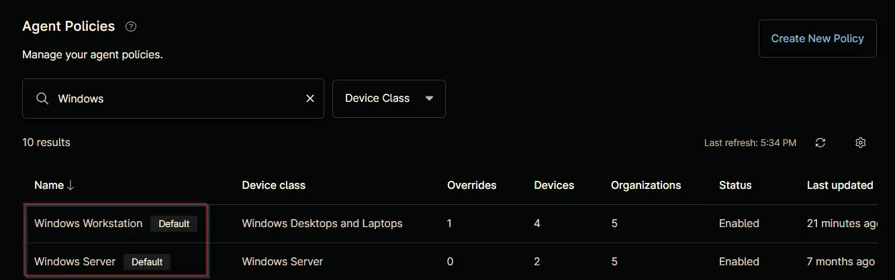
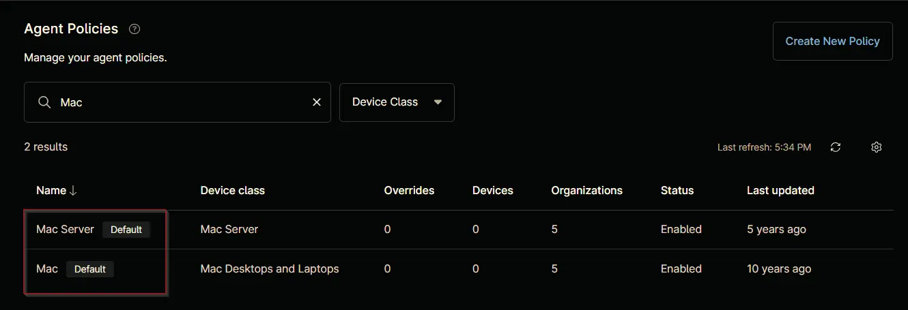

## Purpose

This solution is designed to configure the automatic deployment of the Threatlocker Agent on Windows and Macintosh machines that are missing the agent, using the NinjaOne platform.

## Associated Content

### Custom Field

| Content | Type | Available Options | Function |
| ------- | ---- | ----------------- | -------- |
|[cPVAL Threatlocker Deployment](/docs/c7aa0c9d-9b6b-4a78-bbf4-01a626acd6c2) | Drop-down | `Windows`, `Windows and Macintosh`, `Disabled` | Enables Threatlocker auto-deployment for Windows or both Windows and Macintosh machines at the organization level. |
| [cPVAL Threatlocker Deployment - Exclude](/docs/c3329dd9-bdf8-42f6-aacc-bcfde0fa94da) | Drop-down | `Yes`, `No` | Allows exclusion of specific locations or devices from Threatlocker auto-deployment. |
| [cPVAL Threatlocker Auth Key](/docs/0ff9eab8-6df8-4154-9ecc-4f5bdedd648a) | Text | | Stores the Threatlocker authorization key for Windows machines. |
| [cPVAL Threatlocker Organization Name](/docs/573751d4-0648-4da9-8ec3-0ab96d4730de)  | Text | | Fill it with the organization name under which the Threatlocker agent is to be installed in Threatlocker Portal |
| [cPVAL ThreatLocker Mac GroupKey](/docs/8305e5b2-41ee-44bb-848e-758ac72b185f) | Text | | Stores one or more tags, separated by commas (optional).|

### Automation

| Content | Function |
| ------- | -------- |
| [Threatlocker Deployment](/docs/1196b011-bfba-486a-8653-92066f19e527) | Installs Threatlocker agent on Windows operating systems.          |
| [Threatlocker Deployment [MAC]](/docs/11444307-4a3f-4388-b5c5-096a50725b4e) | Installs Threatlocker agent on Macintosh operating systems.  |

### Compound Conditions

| Content | Function |
| ------- | -------- |
| [Threatlocker Depoyment - Windows](/docs/d7ba7616-f11d-4961-90fb-9e7cf9ed6f28) | Triggers the [Threatlocker Deployment](/docs/1196b011-bfba-486a-8653-92066f19e527) automation on Windows machines where deployment is enabled and `Threatlocker` is not installed. |
| [Threatlocker Deployment - MAC](/docs/73470264-63c3-43d1-a727-1e813cfe768d) | Triggers the [Threatlocker Deployment [MAC]](/docs/11444307-4a3f-4388-b5c5-096a50725b4e) automation on Macintosh machines where deployment is enabled and `Threatlocker` is not installed. |

## Implementation

### Step 1

Create the following custom fields:

- [cPVAL Threatlocker Deployment](/docs/c7aa0c9d-9b6b-4a78-bbf4-01a626acd6c2)
- [cPVAL Threatlocker Deployment - Exclude](/docs/c3329dd9-bdf8-42f6-aacc-bcfde0fa94da) 
- [cPVAL Threatlocker Auth Key](/docs/0ff9eab8-6df8-4154-9ecc-4f5bdedd648a)  
- [cPVAL Threatlocker Organization Name](/docs/573751d4-0648-4da9-8ec3-0ab96d4730de)  
- [cPVAL ThreatLocker Mac GroupKey](/docs/8305e5b2-41ee-44bb-848e-758ac72b185f) 

### Step 2

Create the following automations:

- [Threatlocker Deployment](/docs/1196b011-bfba-486a-8653-92066f19e527) 
- [Threatlocker Deployment [MAC]](/docs/11444307-4a3f-4388-b5c5-096a50725b4e) 

### Step 3

Create the  [Threatlocker Depoyment - Windows](/docs/d7ba7616-f11d-4961-90fb-9e7cf9ed6f28) compound condition for both default agent policies: `Windows Server [Default]` and `Windows Workstation [Default]`. The example in the [document](/docs/73daf0e3-7d35-415b-ab69-386ddd7377e0) illustrates the deployment process for the `Windows Workstations [Default]` agent policy. It is also recommended to apply this compound condition to the `Windows Server [Default]` agent policy, following the same process.  

### Step 4

Create the [Threatlocker Deployment - MAC](/docs/73470264-63c3-43d1-a727-1e813cfe768d) compound condition for both default agent policies: `Mac Server [Default]` and `Mac [Default]`. The example in the [document](/docs/6e7c65c3-3a14-433e-9cbb-617674c1aff0) illustrates the deployment process for the `Mac [Default]` agent policy. It is also recommended to apply this compound condition to the `Mac Server [Default]` agent policy, following the same process.

