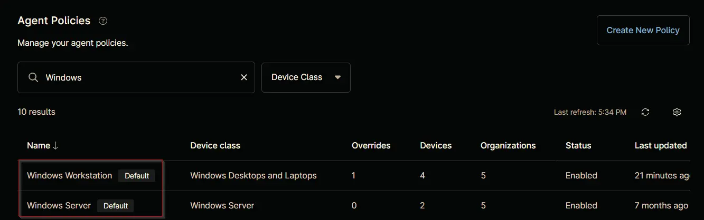
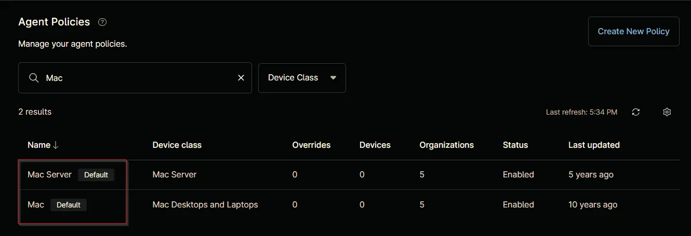

## Purpose

This solution is designed to configure the automatic deployment of the Threatlocker Agent on Windows and Macintosh machines that are missing the agent, using the NinjaOne platform.

## Associated Content

### Custom Field

| Content | Type | Function |
| ------- | ----  -------- |
|[cPVAL Threatlocker Deployment](/docs/c7aa0c9d-9b6b-4a78-bbf4-01a626acd6c2) | custom field | Enables Threatlocker auto-deployment for Windows or both Windows and Macintosh machines at the organization level. |
| [cPVAL Threatlocker Auth Key](/docs/0ff9eab8-6df8-4154-9ecc-4f5bdedd648a) | custom field| Stores the Threatlocker authorization key for Windows machines. |
| [cPVAL Threatlocker Organization Name](/docs/573751d4-0648-4da9-8ec3-0ab96d4730de)  | custom field | Fill it with the organization name under which the Threatlocker agent is to be installed in Threatlocker Portal |
| [cPVAL ThreatLocker Mac GroupKey](/docs/8305e5b2-41ee-44bb-848e-758ac72b185f) | custom field | Stores one or more tags, separated by commas (optional).|

### Automation

| Content | Function | Type |
| ------- | -------- | ------------- |
| [Threatlocker Deployment](/docs/1196b011-bfba-486a-8653-92066f19e527) | Installs Threatlocker agent on Windows operating systems.          | Script |
| [Threatlocker Deployment [MAC]](/docs/11444307-4a3f-4388-b5c5-096a50725b4e) | Installs Threatlocker agent on Macintosh operating systems.  | Script |

### Compound Conditions

| Content | Function | Type |
| ------- | -------- | ------------- |
| [Threatlocker Depoyment - Windows](/docs/d7ba7616-f11d-4961-90fb-9e7cf9ed6f28) | Triggers the [Threatlocker Deployment](/docs/1196b011-bfba-486a-8653-92066f19e527) automation on Windows machines where deployment is enabled and `Threatlocker` is not installed. | Compound conditon |
| [Threatlocker Deployment - MAC](/docs/73470264-63c3-43d1-a727-1e813cfe768d) | Triggers the [Threatlocker Deployment [MAC]](/docs/11444307-4a3f-4388-b5c5-096a50725b4e) automation on Macintosh machines where deployment is enabled and `Threatlocker` is not installed. | Compound conditon |

## Implementation

### Step 1

Create the following custom fields:

- [cPVAL Threatlocker Deployment](/docs/c7aa0c9d-9b6b-4a78-bbf4-01a626acd6c2)
- [cPVAL Threatlocker Auth Key](/docs/0ff9eab8-6df8-4154-9ecc-4f5bdedd648a)  
- [cPVAL Threatlocker Organization Name](/docs/573751d4-0648-4da9-8ec3-0ab96d4730de)  
- [cPVAL ThreatLocker Mac GroupKey](/docs/8305e5b2-41ee-44bb-848e-758ac72b185f)

### Step 2

Create the following automations:

- [Threatlocker Deployment](/docs/1196b011-bfba-486a-8653-92066f19e527)
- [Threatlocker Deployment [MAC]](/docs/11444307-4a3f-4388-b5c5-096a50725b4e)

### Step 3

Create the following Compound conditions:

Create the  [Threatlocker Depoyment - Windows](/docs/d7ba7616-f11d-4961-90fb-9e7cf9ed6f28) compound condition for both default agent policies: `Windows Server [Default]` and `Windows Workstation [Default]`. The example in the [document](/docs/73daf0e3-7d35-415b-ab69-386ddd7377e0) illustrates the deployment process for the `Windows Workstations [Default]` agent policy. It is also recommended to apply this compound condition to the `Windows Server [Default]` agent policy, following the same process.  

### Step 4

Create the [Threatlocker Deployment - MAC](/docs/73470264-63c3-43d1-a727-1e813cfe768d) compound condition for both default agent policies: `Mac Server [Default]` and `Mac [Default]`. The example in the [document](/docs/6e7c65c3-3a14-433e-9cbb-617674c1aff0) illustrates the deployment process for the `Mac [Default]` agent policy. It is also recommended to apply this compound condition to the `Mac Server [Default]` agent policy, following the same process.

## FAQ

Q. What is this solution used for?

A. This solution is used to automatically deploy the ThreatLocker agent on Windows and macOS endpoints managed by NinjaOne when the agent is missing. It ensures consistent security coverage without requiring manual installation.

Q. How does the deployment work?

A. The deployment uses:

Custom Fields to store ThreatLocker configuration values (Auth Key, Organization Name, Mac Group Key)
Compound Conditions to detect eligible devices where ThreatLocker is not installed
Automations (scripts) to install the ThreatLocker agent on Windows and macOS devices
When all conditions are met, NinjaOne automatically triggers the appropriate deployment script.

Q. Which operating systems are supported?

A.  Windows Workstations
    Windows Servers
    macOS Workstations
    macOS Servers
    Each OS type has its own automation and compound condition to ensure correct handling.

Q. Will this reinstall ThreatLocker if it is already installed?

A. No. The compound conditions explicitly check whether the ThreatLocker agent is not installed. If the agent is already present, the deployment script will not run.

Q. Where are the ThreatLocker credentials stored?

A.  Credentials are stored securely using NinjaOne Custom Fields:
    Windows Auth Key: cPVAL Threatlocker Auth Key
    Windows Organization Name: cPVAL Threatlocker Organization Name
    macOS Group Key: cPVAL ThreatLocker Mac GroupKey
    These values are retrieved dynamically at runtime by the deployment scripts.

Q. Can this be enabled or disabled per organization?

A. Yes. The custom field cPVAL Threatlocker Deployment controls whether automatic deployment is enabled at the organization level. This allows granular control over where ThreatLocker is deployed.

Q. Does this require user interaction?

A. No. The deployment runs silently in the background via NinjaOne automations and does not require any user interaction.

Q. Is this safe to run in production?

A.  Yes.
    The solution follows best practices by:
    Checking for existing installations
    Using official ThreatLocker installers
    Separating Windows and macOS logic
    Leveraging NinjaOne’s native automation and condition framework
    However, it is always recommended to validate in a test environment before broad rollout.