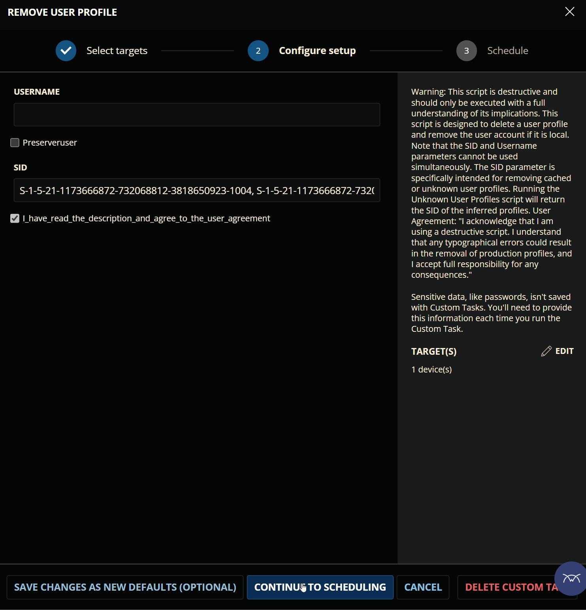

## Purpose

The solution is designed to detect and manage unknown or cached user profiles. These unknown user profiles can occupy significant disk space on the computer. The primary objective of this solution is to identify these profiles to free up unnecessarily used drive space. 

Although the solution does not automatically remove the unknown or cached user profiles, it generates a ticket containing the relevant information about the user profiles that need to be removed. The [Remove User Profile](../cwrmm/tasks/Remove%20User%20Profile.md) task can then be utilized to eliminate these unwanted, unknown, or cached user profiles.

The [Unknown User Profiles](/docs/93f21631-9100-46fc-864b-3af17bc91699) task identifies and returns the Security Identifiers (SIDs) of unknown/cached user profiles, which can then be used as input parameters for the [Remove User Profile](../cwrmm/tasks/Remove%20User%20Profile.md) task.

 

**Caution: The [Remove User Profile](../cwrmm/tasks/remove%20user%20profile.md) task is destructive and should only be used after fully understanding the implications.**

## Associated Content

| Content | Type | Description |
| ------- | ---- | ----------- |
| [Unknown User Profiles Detection](/docs/a7ba6a52-18ae-4c71-8545-5a41999fa41b) | Custom Field | Enabling this custom field will activate the detection of Unknown or Cached user profiles for the company. |
| [Unknown User Profiles Detection](/docs/1c950fdd-99f2-4943-9617-a1d13a4b87ec) | Dynamic Group | The group manages the supported computers for companies that have enabled the [Unknown User Profiles Detection](/docs/a7ba6a52-18ae-4c71-8545-5a41999fa41b) custom field. |
| [Unknown User Profiles](/docs/93f21631-9100-46fc-864b-3af17bc91699) | Task | This Script identifies unknown user-profiles and generates a ticket containing their details. If the computer’s domain trust relationship is broken, the script will create a ticket indicating the broken trust relationship instead of listing unknown user profiles. Note that PowerShell 5 is required to run this script, and domain controllers are excluded from its scope. |
| [Remove User Profile](../cwrmm/tasks/Remove%20User%20Profile.md) | Task | This script is designed to delete a user profile and remove the user account if it is local.  |

## Implementation

- Create the [Unknown User Profiles Detection](/docs/a7ba6a52-18ae-4c71-8545-5a41999fa41b) custom field.  
- Create the [Unknown User Profiles Detection](/docs/1c950fdd-99f2-4943-9617-a1d13a4b87ec) dynamic group.  
- Create the [Unknown User Profiles](/docs/93f21631-9100-46fc-864b-3af17bc91699) task.  
- Deploy/Schedule the [Unknown User Profiles](/docs/93f21631-9100-46fc-864b-3af17bc91699) task.  
- Create the [Remove User Profile](../cwrmm/tasks/Remove%20User%20Profile.md) task.
