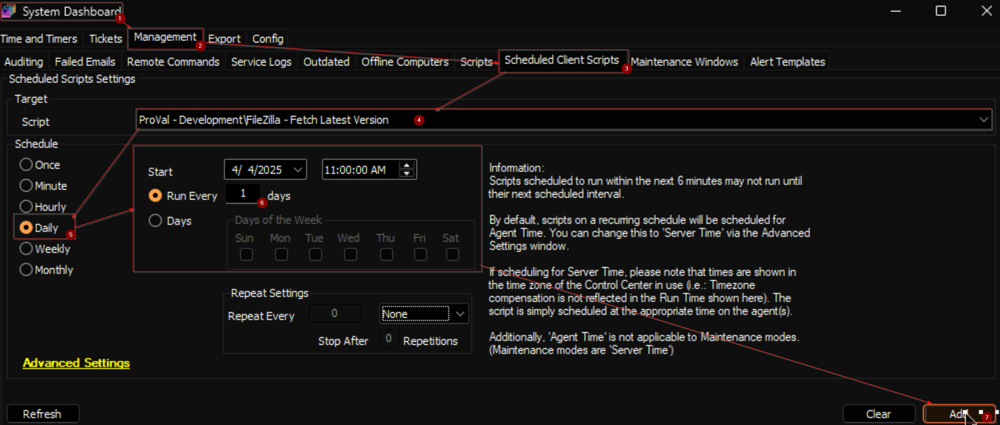

## Purpose

This document outlines the process for updating FileZilla to the latest version on Windows machines using CW Automate.

## Associated Content

| Content | Type | Function |
| ------- | ---- | -------- |
| [FileZilla - Fetch Latest Version](/docs/71141737-d88f-43d3-9e75-e3f5468f888f) | Script | Retrieves the latest version of FileZilla from its official website and stores it in a system property. |
| [FileZilla - Install/Update](/docs/154e2b72-d73f-4693-a316-7a296e4793ec) | Script | Installs or updates FileZilla to the latest version on a Windows computer. |
| [Update FileZilla](/docs/ea7ef637-8620-499a-a982-a805a11e14c7) | Internal Monitor | Identifies Windows machines with an outdated version of FileZilla installed. |
| △ Custom - Execute Script - FileZilla - Install/Update | Alert Template | Runs the [FileZilla - Install/Update](/docs/154e2b72-d73f-4693-a316-7a296e4793ec) script on computers detected by the [Update FileZilla](/docs/ea7ef637-8620-499a-a982-a805a11e14c7) internal monitor. |

## Implementation

### Step 1

Import the following content from `ProSync` plugin:

- [Script - FileZilla - Fetch Latest Version](/docs/71141737-d88f-43d3-9e75-e3f5468f888f)  
- [Script - FileZilla - Install/Update](/docs/154e2b72-d73f-4693-a316-7a296e4793ec)  
- [Internal Monitor - Update FileZilla](/docs/ea7ef637-8620-499a-a982-a805a11e14c7)  
- Alert Template - △ Custom - Execute Script - FileZilla - Install/Update

### Step 2

Reload System Cache

### Step 3

Execute the [FileZilla - Fetch Latest Version](/docs/71141737-d88f-43d3-9e75-e3f5468f888f) script on any client and confirm that the `Filezilla_Latest_Version` system property contains data.

### Step 4

Schedule [FileZilla - Fetch Latest Version](/docs/71141737-d88f-43d3-9e75-e3f5468f888f) script to the run daily during working hours.  

### Step 5

Configure the solution as follows:

- Navigate to `Automation` → `Monitors` within the CWA Control Center and set up the following:  

    - [Internal Monitor - Update FileZilla](/docs/ea7ef637-8620-499a-a982-a805a11e14c7)  
    - Configure with the alert template: `△ Custom - Execute Script - FileZilla - Install/Update`  
    - **Validate that there are no results reporting in the monitor** and right-click and run now to start the monitor.

## FAQ

### Can we use this solution for installation?  

No, the entire solution is designed only to update FileZilla on machines where it is outdated. However, the [Script - FileZilla - Install/Update](/docs/154e2b72-d73f-4693-a316-7a296e4793ec) can be executed manually to install the application on a machine where it is not already present.

### What happens if the `Filezilla_Latest_Version` system property is empty?  

If the `Filezilla_Latest_Version` system property does not contain data after running the [Script - FileZilla - Fetch Latest Version](/docs/71141737-d88f-43d3-9e75-e3f5468f888f), ensure that the script executed successfully and check its logs.

### How do I verify that the update process is working?  

You can verify the update process by checking the results of the [Internal Monitor - Update FileZilla](/docs/ea7ef637-8620-499a-a982-a805a11e14c7). If the monitor reports any machines with outdated versions, ensure the alert template is configured correctly and run the monitor to trigger the update.

### Can this solution be automated?  

Yes, the solution is designed to be automated using the internal monitor and alert template. Once configured, the monitor will automatically detect outdated versions, and the alert template will execute the [update script](/docs/154e2b72-d73f-4693-a316-7a296e4793ec) on the affected machines.

### What should I do if the update fails?  

If the update fails, check the logs of the [Script - FileZilla - Install/Update](/docs/154e2b72-d73f-4693-a316-7a296e4793ec) for errors.