## Purpose

The purpose of this solution is to provide the client with the ability to have Automate prompt the end user to reboot the machine and ensure that the machine eventually gets rebooted (either forcefully or voluntarily by the end user).

## Update Notice: 16-December-2024

A new Client, Location, and Computer-Level Exclusion EDF `Disable Reboot Prompt` has been introduced. Flagging the EDF will exclude the machines at the respective level.

### Steps to import the updates:
- Update the [User Prompt - Reboot](/docs/1789b867-61db-436d-ac0b-07d5aac3f4b8) script from the Prosync plugin.
- Update the [Reboot Pending [Prompt]](/docs/8163996f-f8b6-4b7d-b5b1-6b965a9408d4) internal monitor from the Prosync plugin.
- Run the script [User Prompt - Reboot](/docs/1789b867-61db-436d-ac0b-07d5aac3f4b8) **once** on any machine with the user parameter `SetEnvironment` set to 1.

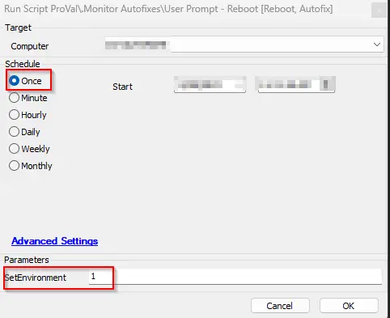

## Update Notice: 06-June-2024

If the `proval_RebootPromptWhenPendingReboot` system property is set to `1` and the computer has a reboot pending flag, but the `Suppress Reboot` policy is applied by the patch manager, and the pending reboot flag was set due to a patch job, the machine will be excluded from the script's functionality. Instead, the prompts and reboot will be managed by Automate's built-in `Suppress Reboot` policy. This may result in inconsistently connected machines not getting a proper reboot.

## Associated Content

| Content | Type | Function |
|---------|------|----------|
| [Reboot Pending [Prompt]](/docs/8163996f-f8b6-4b7d-b5b1-6b965a9408d4) | Internal Monitor | To monitor for machines the client decides need to be rebooted and issue a script to prompt the user. |
| [User Prompt - Reboot](/docs/1789b867-61db-436d-ac0b-07d5aac3f4b8) | Script | To physically handle the reboot prompting and execution. |
| [Reset Reboot Pending EDFs](/docs/e188d9ff-44e7-40e5-a255-d7d2bf0e2f7c) | Script | To clear all flags indicating the machine needs a reboot so they can be set again later. |
| [Reset Reboot Pending EDFs](/docs/79256871-2745-4096-8892-c4554926ed18) | Internal Monitor | This internal monitor is designed to detect the agents whose reboot was done by the script [User Prompt - Reboot](/docs/1789b867-61db-436d-ac0b-07d5aac3f4b8). It detects the agents and triggers the script [Reset Reboot Pending EDFs](/docs/e188d9ff-44e7-40e5-a255-d7d2bf0e2f7c) to clear the EDFs so they can be re-triggered at another time. |
| [Machines with Login Bug Issue](/docs/9c3ebf70-921b-46e4-bdab-409e06e17a5f) | Internal Monitor | This internal monitor detects the agents with Login Bug Issues that have not been rebooted for more than 7 days since detection. |
| △ Custom - Autofix - Prompt for Reboot with Forced Reboot | Alert Template | This template is used with the monitor [Reboot Pending [Prompt]](/docs/8163996f-f8b6-4b7d-b5b1-6b965a9408d4) to schedule the autofix script [User Prompt - Reboot](/docs/1789b867-61db-436d-ac0b-07d5aac3f4b8). |
| △ Custom - Autofix - Reset Reboot Pending EDFs | Alert Template | This template is used with the monitor [Reset Reboot Pending EDFs](/docs/79256871-2745-4096-8892-c4554926ed18) to schedule the autofix script [Reset Reboot Pending EDFs](/docs/e188d9ff-44e7-40e5-a255-d7d2bf0e2f7c). |
| △ Custom - Ticket Creation - Computer | Alert Template | This template is used with the monitor [Machines with Login Bug Issue](/docs/9c3ebf70-921b-46e4-bdab-409e06e17a5f). |
| [User Prompt - Reboot [Audit]](/docs/4ad38519-386a-4645-8cea-a498e0cd0e25) | Dataview | This dataview is designed to track the workings of the [User Prompt for the Reboot](/docs/32d2254e-c2a4-4f2d-a029-b74f6d3c8b1a) solution. |

## Implementation

### Updating Process:
- Remove the monitor 'ProVal - Production - Reboot Pending [Prompt]' (if it exists)
  - Take note of any exclusions made to this monitor; however, there will likely be no customizations to it.
- Remove the monitor [Reset Reboot Pending EDFs](/docs/79256871-2745-4096-8892-c4554926ed18) (if it exists)
- Remove the Alert Template '~Autofix - Prompt for Reboot and Force' (or whatever is assigned to the monitor presently; we will be importing a new alert template with this solution).
  - If you cannot find any alert templates configured, skip over this step.
- Update the script [User Prompt - Reboot](/docs/1789b867-61db-436d-ac0b-07d5aac3f4b8)
- Update the script [Reset Reboot Pending EDFs](/docs/e188d9ff-44e7-40e5-a255-d7d2bf0e2f7c)
- Import both alert templates '△ Custom - Autofix - Reset Reboot Pending EDFs' and '△ Custom - Autofix - Prompt for Reboot with Forced Reboot'
- Delete the Reset Reboot Pending EDFs Script Schedule on the All Agents group

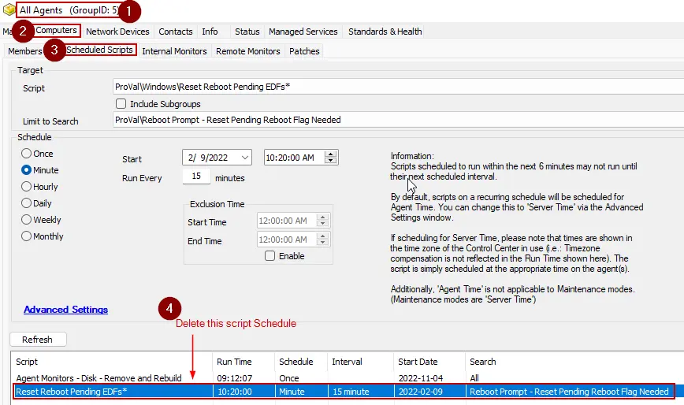

- Proceed through the Fresh Install Process steps.

### Fresh Install Process:
1. Import both scripts outlined in this document (ProSync Plugin)
2. Import all the monitors outlined in this document (ProSync Plugin)
3. Import all the alert templates outlined in this document (ProSync Plugin)
4. Import the dataview outlined in this document (ProSync Plugin)

### Configuration Steps:
1. Set the correct alert templates to the **Disabled** monitors

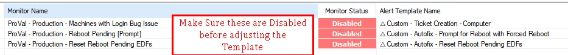

2. Run the script [User Prompt - Reboot](/docs/1789b867-61db-436d-ac0b-07d5aac3f4b8) **once** on any machine with the user parameter `SetEnvironment` set to 1:

   Running the script with this parameter will import the properties below with default values and also import the EDFs as mentioned below:
   - proval_RebootForceTimeDelayMin - Default Setting [5]
   - proval_RebootPromptWhenPendingReboot - Default Setting [0]
   - proval_RebootPromptUptimeDays - Default Setting [0]
   - proval_RebootPromptMSG - Default Setting [Your computer is currently in need of a reboot.]
   - proval_RebootPromptDurBetweenPrompt - Default Setting [4]
   - proval_RebootPromptCount - Default Setting [4]
   - Proval_RebootPromptUsePrompter - Default Setting [0]

   The EDFs imported are:
   1. Last Prompted - Text Box
   2. Times Prompted - Text Box
   3. Pending Reboot - Checkbox

3. Before enabling the monitors, validate that the monitor will return results when checking the 'Pending Reboot' EDF. Simply pick a random workstation that is online, check the 'Pending Reboot' EDF, and save it:

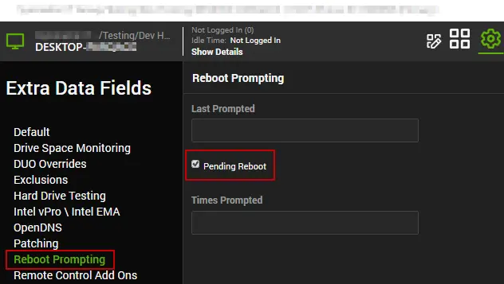

4. Then open the Disabled Monitor 'ProVal - Production - Reboot Pending [Prompt]' and validate that the new machine appears in the results:

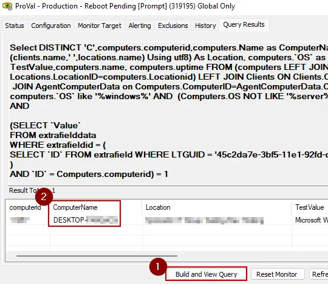

   **NOTE:** If the count is more than 1, then settings are changed from their defaults, and the consultant should weigh in on whether we should enable the monitors or not.

5. After confirming that, you can uncheck the pending reboot box from that machine and fully enable all the monitors.
   - It is recommended to keep the monitor targeting globally to ensure the EDFs, when checked, always prompt the user; however, the client may request for the monitor to be more limited, and in this case, you can enable the monitor specifically for certain groups.

## Prompter Prompt Examples

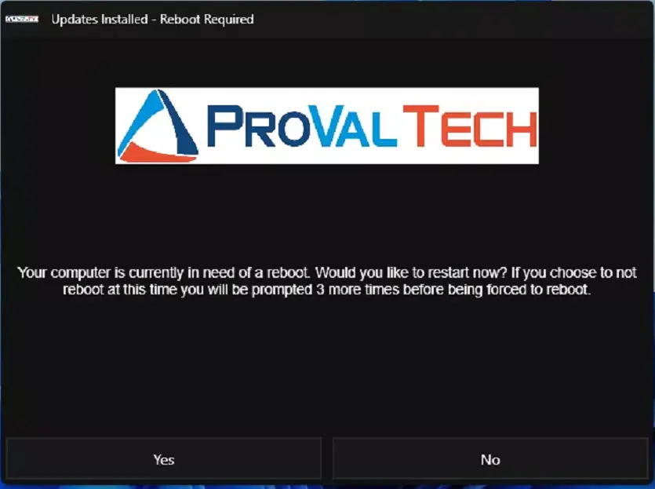

Icon and header images can be set by [https://redirhostname/WCC2/Utilities/HeaderImage](https://redirhostname/WCC2/Utilities/HeaderImage)

At the final prompt, you will receive this popup through Windows FIRST:

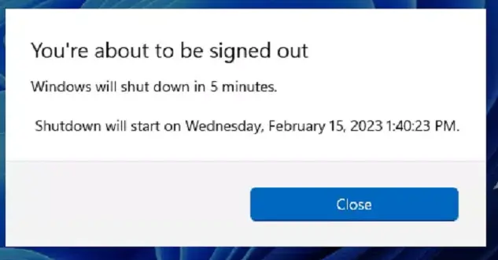

Then this will pop up, explaining the reboot:

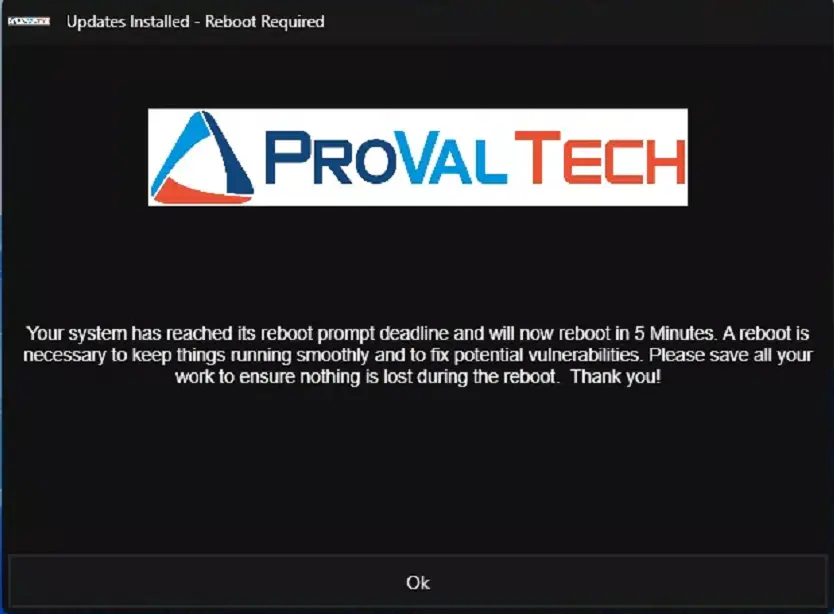

## Automate Prompt Examples

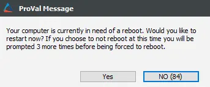

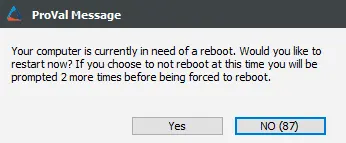

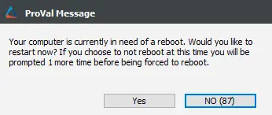

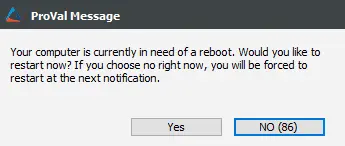

At the final prompt, you will receive this popup through Windows FIRST:

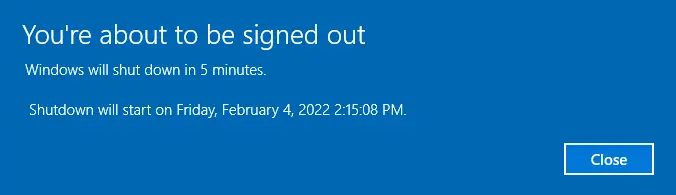

Then this will pop up, explaining the reboot:

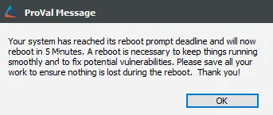

## EDF Examples

- Pending Reboot [Checkbox - Manually Editable]
  - 
- Last Prompted [Text Field - Non Editable]
  - 
- Times Prompted [Text Field - Non Editable]
  - 

## Customizations

| Property | Description | Default Setting |
|----------|-------------|-----------------|
| System Property: proval_RebootPromptCount | How many times the user will be prompted | 4 |
| System Property: proval_RebootPromptDurBetweenPrompt | Amount of time in hours between prompts | 4 |
| System Property: proval_RebootPromptMSG | The default message for the reboot prompt | 'Your computer is currently in need of a reboot.' |
| System Property: proval_RebootPromptUptimeDays | Automatically sets the reboot prompt flag after X days of machine uptime | 0 (Disabled) |
| System Property: proval_RebootPromptWhenPendingReboot | Toggles this solution on the Windows embedded reboot flag | 0 (Disabled) |
| System Property: proval_RebootForceTimeDelayMin | Adjusts the time delay on the forced reboot in minutes | 5 |
| System Property: Proval_RebootPromptUsePrompter | Use [Prompter](/docs/d8a124df-ea81-4194-82fc-a082c7a036d8) instead of Automate's default prompts/messages | 0 (Disabled) |

## Exclusion EDFs

| Name | Type | Section | Level | Description |
|------|------|---------|-------|-------------|
| Disable Reboot Prompt | Checkbox | Exclusions | Client | Flag this EDF to exclude the client from the solution. |
| Disable Reboot Prompt | Checkbox | Exclusions | Location | Flag this EDF to exclude the location from the solution. |
| Disable Reboot Prompt | Checkbox | Exclusions | Computer | Flag this EDF to exclude the computer from the solution. |

## FAQs

**Q: What happens if a user ignores the reboot prompt completely?**  
> If the user does not provide any input, the prompt will time out without taking any action. However, if the system exceeds the allowed defer count or the defer period expires, a forced reboot will occur 5 minutes after the final prompt. Timeout and interval values can be customized using system properties.

**Q: What controls the delay before a forced reboot occurs after the final prompt?**
> The delay before a forced reboot is managed by the system property proval_RebootForceTimeDelayMin. The default delay is 5 minutes, but this can be increased or decreased based on operational requirements.

**Q: Will the reboot prompt appear if the device is idle but the user is logged in?**
> No. The monitor only runs the script on devices that have been active within the last 5 minutes. If the system is idle or sleeping, no prompt will be displayed until the user becomes active again.

**Q: How does the soltuion handles a sleeping device?**
> If a user is logged in but the computer is in sleep mode, the solution takes no action, as the device is considered idle. If no user is logged in, the script will reboot the computer automatically. Reboot prompts are sent only when a user is logged in and the device is actively in use.

**Q: What happens if no user is logged into the device?**
> If no user is logged in, the script will reboot the computer automatically without displaying a prompt.

**Q: Can the reboot prompt be triggered immediately after a reboot?**
> Yes, depending on configuration. If the system property `proval_RebootPromptWhenPendingReboot` is enabled, the prompt will appear whenever a pending reboot is detected, regardless of uptime. If disabled, prompts are delayed until the uptime exceeds the threshold defined in `proval_RebootPromptUptimeDays`.

**Q: Does the solution track why a reboot flag was set?**
> No. The solution cannot identify the source of the reboot flag. However, if the reboot flag is set by Patch Manager and a Suppress Reboot policy is applied, the device will be skipped so Patch Manager can manage the reboot process.

**Q: How does the solution prevent false reboot prompts when a device comes back online?**
> If a device comes online with low uptime (under one hour) and still has the Pending Reboot EDF set, the monitor "ProVal - Production - Reset Reboot Pending EDFs" clears the flag automatically. This prevents unnecessary or incorrect prompts.

**Q: Can I update the logo of the prompt?**
> Yes. You can update the prompt logo by placing the required header image and icon image in the LTShare under the Utilities folder. The prompter will automatically use these images when displaying the prompt. Or you can provide a public URL of your desired image and save it in the global parameters of the script.

**Q: Can specific clients, locations, or computers be excluded from reboot prompting?**
> Yes. The solution includes Exclusion EDFs at the Client, Location, and Computer levels. When the "Disable Reboot Prompt" EDF is checked at any of these levels, the device(s) will be excluded from reboot prompting.

**Q: How can administrators track which devices have received reboot prompts?**
> The "User Prompt – Reboot [Audit]" dataview provides visibility into prompt activity, including when devices were prompted and how many times prompts were displayed. This helps with auditing and troubleshooting.

**Q: Can the default reboot prompt message be customized?**
> Yes. You can modify the prompt text using the system property proval_RebootPromptMSG. This allows organizations to display custom messaging that aligns with internal standards or user communication policies.

**Q: Is there a way to manually choose which device should receive a reboot prompt?**
> Yes. You can manually enable the computer‑level EDF Pending Reboot. Once enabled, the reboot prompt will be triggered for that device based on the configurations defined in the system properties.

**Q: Can I customize the prompt intervals, message, or other settings on a per‑client basis?**
> No. This solution supports only global customization through system properties. While you cannot configure different intervals, messages, or behaviors per client, you can exclude specific clients, locations, or individual computers from the solution using the available exclusion EDFs.

**Q: Can I run the script manually on a computer to trigger a reboot prompt?**
> This script is designed to run only when triggered by `Reboot Pending [Prompt]`. Manual running of this script will output a log entry into the Scripts tab stating, "This script is designed to run only when triggered by a monitor and should not be run manually. Exiting."

## Changelog

### 2026-04-30

- Added FAQs 

### 2025-04-10

- Initial version of the document
