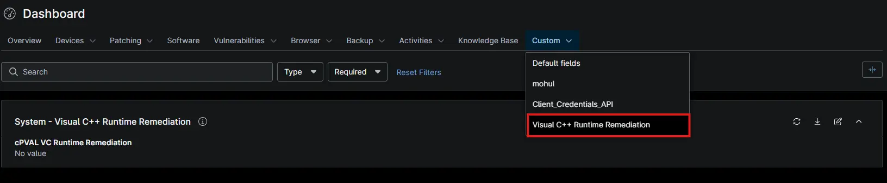
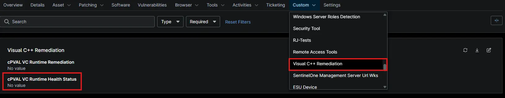

## Purpose

Many Windows applications need the Microsoft Visual C++ 2015-2022 runtime to start. When its files are damaged or missing, those applications fail to open. This solution finds affected Windows workstations and servers in NinjaOne and repairs them automatically.

## How It Works

The solution runs in three steps:

1. **Check:** Every 24 hours, a compound condition runs the [Test VC Runtime](/docs/a63278c8-89e1-4cfc-80dc-7158bd88635f) automation to check the runtime. This check makes no changes.
2. **Repair:** If the runtime is corrupted, the condition runs [Test VC Runtime](/docs/a63278c8-89e1-4cfc-80dc-7158bd88635f) again with `Remediate` checked. It reinstalls the runtime and repairs Windows system files.
3. **Report:** Each device shows the result in the [cPVAL VC Runtime Health Status](/docs/81660c29-6528-4cb0-9dbe-964ba1b4588e) custom field. The condition resets once the runtime is healthy.

## Key Capabilities

* **Daily Detection:** Checks every opted-in device once a day.
* **Automatic Repair:** Reinstalls the latest runtime from Microsoft and repairs Windows system files with DISM and System File Checker (SFC), the built-in Windows repair tools.
* **Safe by Default:** The check makes no changes. Repairs run only on devices where corruption is found.
* **No Restarts:** Never restarts a device. If a restart is needed, the activity output says so.
* **Flexible Scope:** Turn it on for all Windows devices, workstations only, or servers only. Exclude any organization, location, or device.
* **Clear Reporting:** Each device shows `Healthy` or `Corrupted` in a custom field.

---

## Associated Content

### Custom Fields

> **Note on Enablement:** `cPVAL VC Runtime Remediation` has **no default value**. You *must* set it to turn the solution on. See [Step 4](#step-4-enable-the-solution-opt-in).

| Name | Default | Example | Level | Managed By | Function |
| :--- | :--- | :--- | :--- | :--- | :--- |
| [cPVAL VC Runtime Remediation](/docs/c6895ff6-39ae-403c-9436-4830e1a84d4c) | *(unset)* | `Windows` | System, Org, Loc, Dev | Manual | Turns the solution on and selects which devices it covers. |
| [cPVAL VC Runtime Health Status](/docs/81660c29-6528-4cb0-9dbe-964ba1b4588e) | *(blank)* | `Healthy` | Device | Script (Auto) | Shows the result of the latest check: `Healthy` or `Corrupted`. |

#### **System-Level Fields**

#### **Device-Level Fields**

### Automations

| Name | Function |
| :--- | :--- |
| [Test VC Runtime](/docs/a63278c8-89e1-4cfc-80dc-7158bd88635f) | Checks the runtime and, with `Remediate` checked, repairs it. Saves the result to `cPVAL VC Runtime Health Status`. |

### Compound Conditions

| Name | Function |
| :--- | :--- |
| [Test VC Runtime - Windows Workstations](/docs/0f9b6490-325a-4863-8d1a-e4e38f21f0e6) | Checks opted-in workstations every 24 hours and repairs any with a corrupted runtime. |
| [Test VC Runtime - Windows Servers](/docs/8be26d10-ce6c-49b1-99ac-bd5b3bdafc2d) | Checks opted-in servers every 24 hours and repairs any with a corrupted runtime. |

---

## Implementation

### Step 1: Create Custom Fields

This solution uses **2 custom fields**. You can create them in either of two ways.

#### Option A: Import Them From the ProVal NinjaRMM Field Sync Portal

The [NinjaRMM Field Sync](https://ninjafields.provaltech.com/) portal creates both fields for you, with the correct type, scope, permissions, and tab already set.

1. Sign in to the [NinjaRMM Field Sync](https://ninjafields.provaltech.com/) portal.
2. Set the **Source Instance** to `ProVal Dev`.
3. Open **Filters** and set the **Custom Tab** filter to `Visual C++ Remediation`.
4. Confirm the field count reads **2 fields**.
5. Set the **Target Instance** to the partner instance you are implementing in.
6. Select both fields and click **Deploy Selected**.

> **⚠️ Validate the result before moving on.** Confirm that both fields appear on the tabs shown in the [System-Level Fields](#system-level-fields) and [Device-Level Fields](#device-level-fields) screenshots.

#### Option B: Create the Fields Manually

Create each field as described in its document:

* [Custom Field: cPVAL VC Runtime Remediation](/docs/c6895ff6-39ae-403c-9436-4830e1a84d4c)
* [Custom Field: cPVAL VC Runtime Health Status](/docs/81660c29-6528-4cb0-9dbe-964ba1b4588e)

### Step 2: Create the Automation

Create the following automation as described in the document:

* [Automation: Test VC Runtime](/docs/a63278c8-89e1-4cfc-80dc-7158bd88635f)

> *Pro Tip:* Keep the automation's architecture set to 64-bit. The script stops if it runs as 32-bit.

### Step 3: Create Compound Conditions

Create the following compound conditions as described in the document:

* [Compound Condition: Test VC Runtime - Windows Workstations](/docs/0f9b6490-325a-4863-8d1a-e4e38f21f0e6)
* [Compound Condition: Test VC Runtime - Windows Servers](/docs/8be26d10-ce6c-49b1-99ac-bd5b3bdafc2d)

### Step 4: Enable the Solution (Opt-In)

The solution is **opt-in** by design. Set [cPVAL VC Runtime Remediation](/docs/c6895ff6-39ae-403c-9436-4830e1a84d4c) at the System, Organization, Location, or Device level:

| Value | Devices Covered |
| :--- | :--- |
| `Windows` | All Windows workstations and servers. |
| `Windows Workstations` | Windows workstations only. |
| `Windows Servers` | Windows servers only. |
| `Disable` | None. Use it to exclude an organization, location, or device. |

You'll know it worked when opted-in devices show `Healthy` or `Corrupted` in `cPVAL VC Runtime Health Status`. This happens within 24 hours.

---

## FAQs

### General Usage

**Q. What does this solution do?**  
**A:** It finds Windows devices where the Microsoft Visual C++ runtime is damaged or missing files, and repairs them. Applications that need the runtime can then start normally.

**Q. Is this solution turned on automatically?**  
**A:** No. It is **opt-in**. Set `cPVAL VC Runtime Remediation` to turn it on. See [Step 4](#step-4-enable-the-solution-opt-in).

**Q. Which devices are supported?**  
**A:** 64-bit Windows 10 and 11, and Windows Server 2016 and later. Devices need internet access.

**Q. Does the daily check change anything on the device?**  
**A:** No. The check only confirms that the runtime's core files and Windows Registry entries are present. Changes happen only when a repair runs on a corrupted device.

**Q. Can I exclude a single device?**  
**A:** Yes. Set `cPVAL VC Runtime Remediation` to `Disable` on that device. A device-level value overrides the organization and location values.

### Repairs

**Q. What does a repair do?**  
**A:** It reinstalls the latest Visual C++ runtime from Microsoft and repairs Windows system files with DISM and SFC. It then checks the runtime again and deletes the files it downloaded.

**Q. Will a repair restart my devices?**  
**A:** No. If a restart is needed to finish the repair, the activity output says so. Restart the device at a convenient time.

**Q. How long does a repair take?**  
**A:** Usually several minutes. It can take 30 minutes or more when Windows needs deeper repairs.

**Q. Can I check or repair a single device on demand?**  
**A:** Yes. Run the [Test VC Runtime](/docs/a63278c8-89e1-4cfc-80dc-7158bd88635f) automation on the device. Check `Remediate` to repair it, or leave it unchecked to only check it.

**Q. Can I edit the script to change its behavior?**  
**A:** No. The script is digitally signed, and any change stops it from running.

### Troubleshooting

| Problem | Cause | Solution |
| :--- | :--- | :--- |
| The repair activity shows as failed. | The script records the original corruption as an error, even when the repair works. | Check `cPVAL VC Runtime Health Status`. `Healthy` means the repair worked. |
| A device still shows `Corrupted` after a repair. | A repair step failed, or the device needs a restart to finish. | Check the activity output for the failed step. Restart the device if asked, then run [Test VC Runtime](/docs/a63278c8-89e1-4cfc-80dc-7158bd88635f) with `Remediate` checked. |
| Repairs fail on devices that get updates from WSUS (Windows Server Update Services). | DISM cannot download repair files through WSUS. | In Group Policy, enable **Specify settings for optional component installation and component repair**. Select the option to download repair content directly from Windows Update. |
| `cPVAL VC Runtime Health Status` is blank. | The solution is not turned on for the device, or the check could not run. | Confirm `cPVAL VC Runtime Remediation` is set for the device. Check that the device has internet access. |

---

## Changelog

### 2026-09-24

- Initial version of the document.
