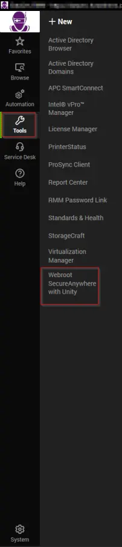
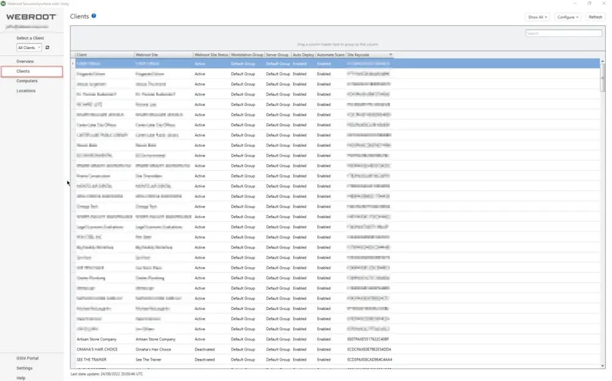
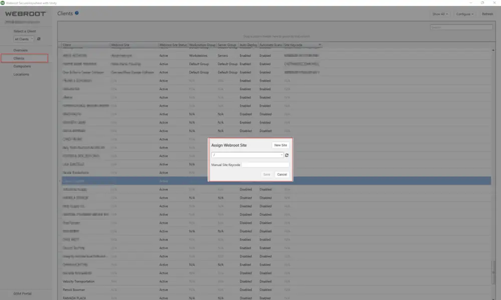

## Description

This solution will handle multiple items related to Webroot Software and ConnectWise Automate.

**Software Classification:** Antivirus - Endpoint Protection

**Popularity:** High

**Installation Difficulty:** Low

**Removal Difficulty:** Moderate

**Solution Implementation Difficulty:** Moderate

**Plugin Requirement:** Yes

**Applicable Systems:** macOS / Windows

- Windows® 7 (32- and 64-bit, all editions), Windows 7 SP1 (32- and 64-bit, all editions)
- Windows 8 (32- and 64-bit)
- Windows 8.1 (32- and 64-bit)
- Windows 10 (32- and 64-bit)
- Windows 11 (64-bit)
- macOS 10.14 (Mojave®)
- macOS 10.15 (Catalina®)
- macOS 11 (Big Sur®) with Apple M1 ARM or Intel® processors
- macOS 12 (Monterey®) with Apple M1 ARM or Intel® processors

**Minimum System Requirements:** macOS / Windows

- Intel® Pentium®/Celeron® family, or AMD® K6/Athlon™/Duron™ family, or other compatible processor
- 128 MB RAM (minimum)
- 10 MB Hard Disk Space
- Internet access
- Google Chrome® version 11 and newer
- Internet Explorer® version 11 and newer (Windows XP IE8)
- Microsoft Edge® (partial support)
- Mozilla® Firefox® version 3.6 and newer
- Safari 5 and newer
- Opera 11 and newer

## Plugin Requirements

1. The Webroot ConnectWise Automate Plugin must be installed and configured with the proper WSA keycode.

### Configuring a Webroot Client

1. Open the Webroot SecureAnywhere with Unity plugin.  
   

2. Right-click the client to configure and assign the associated Webroot site.  
     
   

#### Implementation Setup

1. Use the Webroot Plugin to deploy Webroot.

## Automatic Installation

Use the Webroot Plugin to autodeploy Webroot.

#### Implementation Configuration

The Webroot Plugin provides a way to automatically deploy Webroot by setting the auto-deploy column as desired for computer, location, and client. Once this is completed, the internal monitor (Webroot 3 - Not Installed), created on all the service plan groups by Webroot, will flag any computer that has its auto-deploy set to enabled, where the client and location are also enabled. Once the target is flagged by the monitor, the alert template (Webroot - Install Agent) will run the Webroot 3.0 - Install SecureAnywhere script, installing the software.

## Auditing

*Auditing parts.*

**Search:** Webroot Installed - Windows

**Scheduled Script:** [EPM - Data Collection - Script - Webroot Hashed Key Retrieval [DV]](/docs/4d3b24f2-a55a-4f57-8cad-1345d1e85060)

**Audit Items:**

- Keycode
- Installation Status Windows
- Service Not Running

#### Implementation Setup

Import the Script [EPM - Data Collection - Script - Webroot Hashed Key Retrieval [DV]](/docs/4d3b24f2-a55a-4f57-8cad-1345d1e85060) and run it.