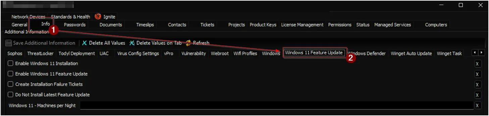
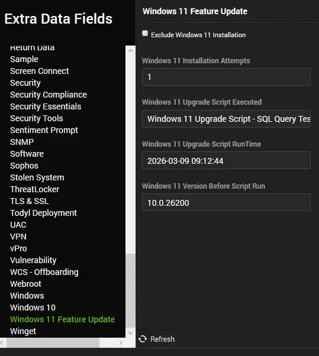
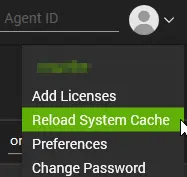

## Summary

This solution is designed to upgrade Windows 10 and 11 systems to version 24H2, as well as install the latest available Windows 11 feature update on machines already running 24H2. It can be used to:

- Upgrade Windows 10 to Windows 11 24H2.
- Upgrade older versions of Windows 11 to Windows 11 24H2.
- Install the latest available feature update on Windows 11 24H2.

The solution upgrades computers to the latest Windows 11 feature update in two phases. In the first phase, it installs Windows 11 24H2 on Windows 10 or older Windows 11 machines. In the second phase, it installs the latest available feature update (at least two days after the initial upgrade) on the newly upgraded 24H2 machine. It also offers a troubleshooting script to manually attempt the upgrade if automation fails.

There is an option to enable ticketing for machines where automation fails three or more times, helping to identify problematic devices. Additionally, the solution includes a dataview to track the success and failure of the deployment across the environment.

**Notes**:

- Enabling the client-level EDF `Enable Windows 11 Installation` activates Windows 11 24H2 installation for the client's Windows 10 machines.
- Enabling the client-level EDF `Enable Windows 11 Feature Update` activates the latest feature update installation for Windows 11 24H2 machines, and Windows 11 24H2 installation for older Windows 11 machines.
- The client-level EDF `Do Not Install Latest Feature Update` can be used to prevent the installation of the latest feature update if needed. This limits the solution to its first phase, installing Windows 11 24H2 only.
- The [Windows 11 Compatibility Audit](/docs/f0bb3ffc-60cb-484c-b7fa-27a386ac664c) solution should be enabled for both Windows 10 and Windows 11.
- [Windows 10 ESU Licensing and Auditing](/docs/7fe6a52b-79fd-487b-8009-523996e74d11) should only be enabled if you wish to explicitly exclude ESU-licensed Windows 10 computers from the upgrade; otherwise, ESU-licensed devices will also be targeted.
- The [plugin_proval_windows_os_support](/docs/938cd822-f6a3-4ee3-add2-62b407e45622) custom table should be kept up-to-date in the environment.

**Key Components**:

1. **[Script: Windows 11 Installer](/docs/a4668ce4-9788-47a9-bb3b-1997367803ad)**:
    - Installs Windows 11 24H2 on compatible Windows 10 and 11 machines.
    - Can be executed manually as a standalone script with no execution limits.

2. **[Internal Monitor: Install Windows 11 24H2 - Compatible Machines](/docs/db122f12-3d6b-48ae-8c8b-e9de9797ecad)**:
    - Automatically executes the [Windows 11 Installer](/docs/a4668ce4-9788-47a9-bb3b-1997367803ad) script on compatible Windows 10 and older Windows 11 machines.
    - Runs during off-hours (6:00 PM to 6:00 AM) to prevent disruptions, as the installation process involves a forced reboot.
    - Retries failed machines every 48 hours, up to a maximum of three attempts per machine.

3. **[Script: Install Windows 11 Feature Update [Update Assistant, Reboot]](/docs/50c89c87-2a2c-4ba8-a15b-ac05722a81ec)**:
    - Installs the latest available feature update on Windows 11 24H2 machines.
    - Can be executed manually as a standalone script with no execution limits.

4. **[Internal Monitor: Install Windows 11 Latest Feature Update - Compatible Machines](/docs/0a6c0ea2-f1d1-4e29-bcc5-954341d10baa)**:
    - Automatically executes the [Install Windows 11 Feature Update [Update Assistant, Reboot]](/docs/50c89c87-2a2c-4ba8-a15b-ac05722a81ec) script on compatible Windows 11 24H2 machines.
    - Runs during off-hours (6:00 PM to 6:00 AM) to prevent disruptions, as the installation process involves a forced reboot.
    - Targets machines where an upgrade script has not been executed within the last two days.
    - Retries failed machines every 48 hours, up to a maximum of three attempts per machine.

5. **[Script: Install Windows 11 Feature Update [Troubleshoot, Reboot]](/docs/27f8240b-603a-4af2-b9d9-480a560f8747)**:
    - Can be run manually to troubleshoot and attempt to install the latest feature update on machines where automation failed.
    - **Warning**: This script can restart the computer up to seven times and should be used with caution.

6. **[Dataview: Windows 11 Installation Audit [Compatible Machines]](/docs/a9cf49a9-c8e0-432c-ae8e-9560d38bf1ce)**:
    - Provides an overview of the automation process, enabling administrators to track the progress and status of the upgrade across all machines.

## Associated Content

### Dependencies

| Content                                                                                                      | Type             | Function                                                                            |
| ------------------------------------------------------------------------------------------------------------ | ---------------- | ----------------------------------------------------------------------------------- |
| [Windows 11 Compatibility Audit](/docs/f0bb3ffc-60cb-484c-b7fa-27a386ac664c)                     | Solution         | Determines the compatibility of Windows 10 and 11 machines for Windows 11 24H2 installation. |
| [Windows 10 ESU Licensing and Auditing](/docs/7fe6a52b-79fd-487b-8009-523996e74d11)                     | Solution         | Audits Windows 10 Extended Security Updates (ESU) license status across Windows 10 22H2 machines. |
| [plugin_proval_windows_os_support](/docs/938cd822-f6a3-4ee3-add2-62b407e45622)                     | Custom Table         | Stores Windows operating systems' support end dates, build numbers, and respective release information. |

### Phase 1: Automation

| Content                                                                                                      | Type             | Function                                                                            |
| ------------------------------------------------------------------------------------------------------------ | ---------------- | ----------------------------------------------------------------------------------- |
| [Windows 11 Installer](/docs/a4668ce4-9788-47a9-bb3b-1997367803ad)                                           | Script           | Installs Windows 11 24H2.                                   |
| [Install Windows 11 24H2 - Compatible Machines](/docs/db122f12-3d6b-48ae-8c8b-e9de9797ecad)                       | Internal Monitor | Executes the Windows 11 Installer script on compatible Windows 10 and older Windows 11 machines.            |
| `△ Custom - Install Windows 11 - Compatible Machines`                                                          | Alert Template   | Executes the script detected by the internal monitor.                               |

### Phase 2: Automation

| Content                                                                                                      | Type             | Function                                                                            |
| ------------------------------------------------------------------------------------------------------------ | ---------------- | ----------------------------------------------------------------------------------- |
| [Install Windows 11 Feature Update [Update Assistant, Reboot]](/docs/50c89c87-2a2c-4ba8-a15b-ac05722a81ec) | Script | Installs the latest available feature update on Windows 11 24H2 machines. |
| [Install Windows 11 Latest Feature Update - Compatible Machines](/docs/0a6c0ea2-f1d1-4e29-bcc5-954341d10baa)  | Internal Monitor | Executes the feature update installation script on compatible Windows 11 24H2 machines.  |
| `△ Custom - Install Windows 11 Feature Update - Compatible Machines`  | Alert Template   | Executes the script detected by the internal monitor.                               |

### Auditing

| Content                                                                                                      | Type             | Function                                                                            |
| ------------------------------------------------------------------------------------------------------------ | ---------------- | ----------------------------------------------------------------------------------- |
| [Windows 11 Installation Audit [Compatible Machines]](/docs/a9cf49a9-c8e0-432c-ae8e-9560d38bf1ce) | Dataview | Provides an overview of the automation process. |

### Additional Content

| Content                                | Type             | Function                                                                 |
|----------------------------------------|------------------|-------------------------------------------------------------------------|
| [Windows 11 Upgrade Failure [Ticket]](/docs/ad564b3a-e4dc-4e47-90dd-52ca8fbc6d52) | Script | Generates a ticket for failed machines. |
| [Install Windows 11 Feature Update [Troubleshoot, Reboot]](/docs/27f8240b-603a-4af2-b9d9-480a560f8747) | Script | Workaround script for machines with installation errors. |
| [Windows 11 Feature Update [Cleanup]](/docs/e0f9ecf2-eac8-4bd1-a269-0dbf7bd0a645) | Script | Used by the feature update script to perform post-upgrade cleanup.  |

### EDFs

| Name | Type | Level | Section | Description |
| --- | --- | --- | --- | --- |
| **Enable Windows 11 Installation** | Check-Box | Client | Windows 11 Feature Update | Enable this option to activate Windows 11 installation for compatible Windows 10 machines. |
| **Enable Windows 11 Feature Update** | Check-Box | Client | Windows 11 Feature Update | Enable this option to allow compatible Windows 11 devices running older versions to install the Windows 11 feature update. If **Do Not Install Latest Feature Update** is enabled, the installation is restricted to version 24H2 only. |
| **Do Not Install Latest Feature Update** | Check-Box | Client | Windows 11 Feature Update | Enable this option to restrict Windows 11 updates to version 24H2 only. This setting applies only when **Enable Windows 11 Feature Update** is active. |
| **Windows 11 - Machines per Night** | Text | Client | Windows 11 Feature Update | Sets the daily batch limit; defaults to 5 if blank. This limit applies separately to new installations and feature updates. Example: If set to 2, up to two machines for installation and two for updates will be selected. |
| **Create Installation Failure Tickets** | Check-Box | Client | Windows 11 Feature Update | Enable this option to automatically generate tickets for computers with more than 3 failed installation attempts. |
| **Exclude Windows 11 Installation** | Check-Box | Location | Exclusions | Enable this option to exclude all computers at this location from the Windows 11 Installation and Upgrade solution. |
| **Exclude Windows 11 Installation** | Check-Box | Computer | Windows 11 Feature Update | Enable this option to exclude this computer from the Windows 11 Installation and Upgrade solution. |
| **Windows 11 Upgrade Script Executed** | Text | Computer | Windows 11 Feature Update | Read-only field that records the name of the most recently executed upgrade script. |
| **Windows 11 Upgrade Script RunTime** | Text | Computer | Windows 11 Feature Update | Read-only field that records the start time of the most recently executed upgrade script. |
| **Windows 11 Version Before Script Run** | Text | Computer | Windows 11 Feature Update | Read-only field that records the OS build of the machine prior to the script execution. |

#### **Client-Level EDFs**

#### **Computer-Level EDFs**

## Implementation

1. Implement the [Windows 11 Compatibility Audit](/docs/f0bb3ffc-60cb-484c-b7fa-27a386ac664c) solution following the instructions in its documentation.

2. Implement the [Windows 10 ESU Licensing and Auditing](/docs/7fe6a52b-79fd-487b-8009-523996e74d11) solution if required.  
    **Note:** This solution should only be implemented after obtaining partner confirmation.

3. Ensure the [plugin_proval_windows_os_support](/docs/938cd822-f6a3-4ee3-add2-62b407e45622) custom table is up-to-date with the latest information available in ProVal's development environment.

4. Import the following scripts using the ProSync Plugin:
    - [Script: Windows 11 Installer](/docs/a4668ce4-9788-47a9-bb3b-1997367803ad)  
    - [Script: Windows 11 Upgrade Failure [Ticket]](/docs/ad564b3a-e4dc-4e47-90dd-52ca8fbc6d52)  
    - [Script: Install Windows 11 Feature Update [Troubleshoot, Reboot]](/docs/27f8240b-603a-4af2-b9d9-480a560f8747)  
    - [Script: Install Windows 11 Feature Update [Update Assistant, Reboot]](/docs/50c89c87-2a2c-4ba8-a15b-ac05722a81ec)
    - [Script: Windows 11 Feature Update [Cleanup]](/docs/e0f9ecf2-eac8-4bd1-a269-0dbf7bd0a645)

5. Import the following internal monitors using the ProSync Plugin:
    - [Internal Monitor: Install Windows 11 24H2 - Compatible Machines](/docs/db122f12-3d6b-48ae-8c8b-e9de9797ecad)  
    - [Internal Monitor: Install Windows 11 Latest Feature Update - Compatible Machines](/docs/0a6c0ea2-f1d1-4e29-bcc5-954341d10baa)

6. Import the following alert templates using the ProSync Plugin:
    - Alert Template: `△ Custom - Install Windows 11 - Compatible Machines`
    - Alert Template: `△ Custom - Install Windows 11 Feature Update - Compatible Machines`

7. Import the following dataview using the ProSync Plugin:
    - [Dataview: Windows 11 Installation Audit [Compatible Machines]](/docs/a9cf49a9-c8e0-432c-ae8e-9560d38bf1ce)  

8. Reload the system cache:  
    

9. Execute **one** of the following scripts with the `Set_Environment` parameter set to `1` against any online Windows 11 machine to create the EDFs required by the solution.
    - [Script: Windows 11 Installer](/docs/a4668ce4-9788-47a9-bb3b-1997367803ad)
    - [Script: Install Windows 11 Feature Update [Troubleshoot, Reboot]](/docs/27f8240b-603a-4af2-b9d9-480a560f8747)  
    - [Script: Install Windows 11 Feature Update [Update Assistant, Reboot]](/docs/50c89c87-2a2c-4ba8-a15b-ac05722a81ec)

    

10. Reload the system cache:  
    

11. Configure the Phase 1 automation as outlined below:  
    - Navigate to **Automation > Monitors** within the CWA Control Center and configure the following:  
        - [Internal Monitor: Install Windows 11 24H2 - Compatible Machines](/docs/db122f12-3d6b-48ae-8c8b-e9de9797ecad)  
            - Alert Template: `△ Custom - Install Windows 11 - Compatible Machines`
            - Action: Right-click and select **Run Now** to start the monitor.

12. Configure the Phase 2 automation as outlined below:  
    - Navigate to **Automation > Monitors** within the CWA Control Center and configure the following:  
        - [Internal Monitor: Install Windows 11 Latest Feature Update - Compatible Machines](/docs/0a6c0ea2-f1d1-4e29-bcc5-954341d10baa)
            - Alert Template: `△ Custom - Install Windows 11 Feature Update - Compatible Machines`
            - Action: Right-click and select **Run Now** to start the monitor.

13. Schedule the [Script: Windows 11 Upgrade Failure [Ticket]](/docs/ad564b3a-e4dc-4e47-90dd-52ca8fbc6d52) script to run once per day.  
    **Note:** This script should only be scheduled after obtaining partner confirmation, as it generates tickets and may produce significant noise.

## Changelog

### 2026-03-09

- Renamed the solution from `Windows 11 24H2 Installation` to `Windows 11 Installation and Feature Update`.
- Introduced new EDFs for enhanced progress tracking.
- Added a new monitor and script to automate the installation of the latest available feature update.
- Updated the dataview for improved reporting.

### 2025-12-15

- Name of the solution got updated from "Windows 11 Installation" to "Windows 11 24H2 Installation".  "Windows 11 Installer" script is updated to install 24H2 and 25H2.
"Install Windows 11 24H2 - Compatible Machines" monitor set is updated to exclude ESU licensed machines.
A new client-level EDF "Windows 11 - Machines per Night" is added to control the number of machines to upgrade per night for the client.

### 2025-04-11

- Update the solution to not execute the more than 2 times on a machine from automation. Addition of a dataview to log success/failure and attempts and Created a workaround script to perform all required steps and attempt to install windows 11 (Install Windows 11 Feature Update [Beta, Reboot])

### 2025-04-10

- Initial version of the document
