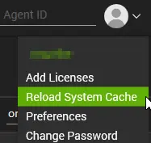

## Purpose

Designed to upgrade Windows 10 and 11 systems to 24H2. It can be used to:

- Upgrade Windows 10 to Windows 11
- Install Windows 11 feature updates

**Notes**:

- Enabling the client-level EDF `Enable Windows 11 Installation` enables Windows 11 24H2 installation for Windows 10 machines of the client.
- Enabling the client-level EDF `Enable Windows 11 Feature Update` enables Windows 11 24H2 installation for Windows 11 machines of the client.
- [Windows 11 Compatibility Audit](/docs/f0bb3ffc-60cb-484c-b7fa-27a386ac664c) solution should be enabled for Windows 11 as well.
- [Windows 10 ESU Licensing and Auditing](/docs/7fe6a52b-79fd-487b-8009-523996e74d11) should only be enabled if partner wants to explicitly exclude the ESU licensed Windows 10 computers from upgrade.

**Key Components**:

1. [Script : Windows 11 Installer](/docs/a4668ce4-9788-47a9-bb3b-1997367803ad):  
    - Used to install Windows 11 24H2 on compatible Windows 10 and 11 machines.
    - It can be used manually to install 25H2 as well.
    - It can also be executed manually as a standalone script with no limits on the number of executions.

2. [Internal Monitor : Install Windows 11 24H2 - Compatible Machines](/docs/db122f12-3d6b-48ae-8c8b-e9de9797ecad):  
    - Configured to automatically execute Windows 11 Installer script on compatible Windows 10 machines.  
    - Runs during off-hours (6:00 PM to 6:00 AM) to prevent disruptions during working hours, as the installation process involves forced computer reboots.  
    - For machines where the script fails during the initial execution, it will retry once per week, up to a maximum of three attempts per machine.

3. [Dataview : Windows 11 Installation Audit [Compatible Machines]](/docs/a9cf49a9-c8e0-432c-ae8e-9560d38bf1ce):  
    - Provides an overview of the automation process, enabling administrators to track the progress and status of the upgrade across all machines.

## Update Notice: 08-December-2025

- [Windows 11 Installer](/docs/a4668ce4-9788-47a9-bb3b-1997367803ad) script is updated to install 24H2 and 25H2.
- [Install Windows 11 24H2 - Compatible Machines](/docs/db122f12-3d6b-48ae-8c8b-e9de9797ecad) monitor set is updated to exclude ESU licensed machines.
- A new client-level EDF `Windows 11 - Machines per Night` is added to control the number of machines to upgrade per night for the client.

## Update Notice: 08-April-2025

The following scripts have been incorporated into the solution:

- [Windows 11 Upgrade Failure [Ticket]](/docs/ad564b3a-e4dc-4e47-90dd-52ca8fbc6d52)  
- [Install Windows 11 Feature Update [Beta, Reboot]](/docs/27f8240b-603a-4af2-b9d9-480a560f8747)

## Associated Content

| Content                                                                                                      | Type             | Function                                                                            |
| ------------------------------------------------------------------------------------------------------------ | ---------------- | ----------------------------------------------------------------------------------- |
| [Solution - Windows 11 Compatibility Audit](/docs/f0bb3ffc-60cb-484c-b7fa-27a386ac664c)                     | Solution         | Determine the compatibility of Windows 10 and 11 machines for Windows 11 24H2 installation. |
| [Solution - Windows 10 ESU Licensing and Auditing](/docs/7fe6a52b-79fd-487b-8009-523996e74d11)                     | Solution         | Audits Windows 10 Extended Security Updates (ESU) license status across Windows 10 22H2 machines. |
| [Windows 11 Installer](/docs/a4668ce4-9788-47a9-bb3b-1997367803ad)                                           | Script           | Installs Windows 11 24H2. The script can be used manually to install 25H2 as well.                                   |
| [Install Windows 11 24H2 - Compatible Machines](/docs/db122f12-3d6b-48ae-8c8b-e9de9797ecad)                       | Internal Monitor | Executes Windows 11 Installer script on compatible Windows 10 machines.             |
| [Dataview - Windows 11 Installation Audit [Compatible Machines]](/docs/a9cf49a9-c8e0-432c-ae8e-9560d38bf1ce) | Dataview         | Displays the outcome of automation.                                                 |
| △ Custom - Install Windows 11 - Compatible Machines                                                          | Alert Template   | Executes the script detected by the internal monitor.                               |

### Additional Content

| Content                                | Type             | Function                                                                 |
|----------------------------------------|------------------|-------------------------------------------------------------------------|
| [Windows 11 Upgrade Failure [Ticket]](/docs/ad564b3a-e4dc-4e47-90dd-52ca8fbc6d52) | Script | Generates a ticket for the erroneous machines |
| [Install Windows 11 Feature Update [Beta, Reboot]](/docs/27f8240b-603a-4af2-b9d9-480a560f8747) | Script | Workaround script for erroneous machines |

## Implementation

1. Implement the Windows 11 Compatibility Audit solution as instructed in this document.  

2. Import the following content using the ProSync Plugin:
    - [Script : Windows 11 Installer](/docs/a4668ce4-9788-47a9-bb3b-1997367803ad)  
    - [Script: Windows 11 Upgrade Failure [Ticket]](/docs/ad564b3a-e4dc-4e47-90dd-52ca8fbc6d52)  
    - [Script: Install Windows 11 Feature Update [Beta, Reboot]](/docs/27f8240b-603a-4af2-b9d9-480a560f8747)  
    - [Internal Monitor : Install Windows 11 24H2 - Compatible Machines](/docs/db122f12-3d6b-48ae-8c8b-e9de9797ecad)  
    - [Dataview : Windows 11 Installation Audit [Compatible Machines]](/docs/a9cf49a9-c8e0-432c-ae8e-9560d38bf1ce)  
    - Alert Template: △ Custom - Install Windows 11 - Compatible Machines

3. Reload the system cache:  

4. Configure the solution as outlined below:  
    - Navigate to Automation --> Monitors within the CWA Control Center and setup the following:  
        - [Internal Monitor : Install Windows 11 - Compatible Machines](/docs/db122f12-3d6b-48ae-8c8b-e9de9797ecad)  
            - Alert Template: △ Custom - Install Windows 11 - Compatible Machines
            - Right-click and Run Now to start the monitor

5. Schedule the [Script: Windows 11 Upgrade Failure [Ticket]](/docs/ad564b3a-e4dc-4e47-90dd-52ca8fbc6d52) script to run once per day.  
**Note:** This script should only be scheduled after obtaining partner confirmation, as it generates tickets and may produce significant noise.

## EDF

| Name | Type | Level | Section | Description |
| --- | --- | --- | --- | --- |
| **Enable Windows 11 Installation** | Check-Box | Client | Default | Enables automation for the client (Windows 10 upgrades). |
| **Enable Windows 11 Feature Update** | Check-Box | Client | Default | Enables automation for the client (Windows 11 version updates). |
| **Exclude Windows 11 Installation** | Check-Box | Location | Exclusions | Exclude location from the automation. |
| **Exclude Windows 11 Installation** | Check-Box | Computer | Exclusions | Exclude specific computer from the automation. |
| **Windows 11 Installation Attempts** | Text | Computer | Default | A non-editable EDF, updated by the installer script to track failure counts. |
| **ESU Detection** | Text | Computer | Default | Stores ESU status (e.g., 'ESU Activated'). Used to exclude paying ESU machines. |
| **Windows 11 - Machines per Night** | Text | Client | Default | Defines the daily batch limit for the client. If blank, defaults to 5. |