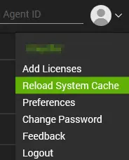
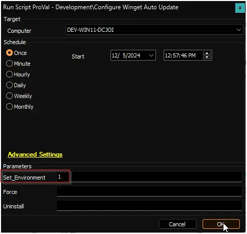

## Purpose

The Winget Auto Update solution keeps applications that are managed by Microsoft’s Winget package manager up to date on your Windows computers. It can also optionally audit (inventory) those applications and report their current versions back to your Automate dashboard.

The solution is entirely self‑contained – it uses its own portable copy of Winget and does not rely on any third‑party software. It can be configured to work in three modes:

- **Update and Audit** – Automatically update applications on a schedule and collect inventory data.
- **Audit Only** – Collect inventory data without applying any updates.
- **Disabled** – Do nothing on the computer.

## Associated Content

### Auditing (inventory)

| Content                                                                 | Type          | Function                                                                                          |
|-------------------------------------------------------------------------|---------------|---------------------------------------------------------------------------------------------------|
| [Winget App Audit](/docs/d5ea54f9-07c9-443b-acc2-411401cfbe91)    | Script        | Collects information about all Winget‑supported applications installed on a computer.            |
| [pvl_winget_audit](/docs/904989a6-fe21-4e40-adb6-17d1168c830e)               | Custom Table  | Stores the inventory data gathered by the audit script.                                           |
| [Winget App Audit](/docs/399a36e3-da83-4437-914b-71e9b844c0d2)    | Dataview      | Displays the inventory data in a user‑friendly table.                                             |
| [Execute Script - Winget App Audit](/docs/af67ed08-40af-4899-ae8f-5e64f9bfb851) | Internal Monitor | Detects Windows computers that haven’t been audited in the past 7 days and triggers the audit script. |
| △ Custom - Execute Script - Winget App Audit                             | Alert Template | Runs the [Winget App Audit](/docs/d5ea54f9-07c9-443b-acc2-411401cfbe91) script on the computers found by the internal monitor. |

### Automation (update configuration)

| Content                                                                 | Type          | Function                                                                                          |
|-------------------------------------------------------------------------|---------------|---------------------------------------------------------------------------------------------------|
| [Configure Winget Auto Update](/docs/1e0c72c6-b9aa-454a-8643-ac7c7e1e7d55) | Script        | Sets up the portable Winget update solution on the endpoint and creates the required scheduled tasks. |
| [pvl_wau_config](/docs/be117f3c-0af2-4edb-8fcc-06da1a4db062)      | Custom Table  | Stores the current update configuration (whitelist, blacklist, schedule, etc.) for each computer. |
| [Winget Auto Update Errors](/docs/68a14948-368f-4064-97a3-d1928e122013) | Remote Monitor | Checks if the most recent update run failed and, if so, creates a ticket with the error details.  |
| [Winget Auto Update Configuration Check](/docs/a6200c89-b918-43a9-8632-fa2effac2e0c) | Remote Monitor | Checks every hour that the scheduled tasks and configuration table are intact. If something is missing, it directly runs the Configure Winget Auto Update script with the Force parameter via its alert template. |
| [Execute Script - Configure Winget Auto Update](/docs/a2fa065f-6f76-4442-a0e0-a64365f6c331) | Internal Monitor | Compares the current EDF settings with the stored configuration and runs the configure script if anything has changed (or if the configuration check remote monitor is missing, it returns “Force” to trigger a repair). |
| △ Custom - Execute Script - Configure Winget Auto Update               | Alert Template | Executes the [Configure Winget Auto Update](/docs/1e0c72c6-b9aa-454a-8643-ac7c7e1e7d55) script. Used by both the internal monitor (for configuration changes) and the configuration check remote monitor (for immediate repair). |

**Client‑Level EDFs:**  

The `Exclude From Winget Auto Update` checkbox is available in the location and computer‑level EDF section `Exclusions` to exclude a specific location or individual computer.

> **Note:** For a complete list of all EDFs and their meaning, refer to the [Configure Winget Auto Update](/docs/1e0c72c6-b9aa-454a-8643-ac7c7e1e7d55) documentation.

## Implementation

1. **Import the auditing content** using the ProSync Plugin:
   - [Script - Winget App Audit](/docs/d5ea54f9-07c9-443b-acc2-411401cfbe91)
   - [Dataview - Winget App Audit](/docs/399a36e3-da83-4437-914b-71e9b844c0d2)
   - [Internal Monitor - Execute Script - Winget App Audit](/docs/af67ed08-40af-4899-ae8f-5e64f9bfb851)
   - Alert Template - △ Custom - Execute Script - Winget App Audit

2. **Import the automation content** (if you plan to use automatic updates) using the ProSync Plugin:
   - [Script - Configure Winget Auto Update](/docs/1e0c72c6-b9aa-454a-8643-ac7c7e1e7d55)
   - [Internal Monitor - Execute Script - Configure Winget Auto Update](/docs/a2fa065f-6f76-4442-a0e0-a64365f6c331)
   - Alert Template - △ Custom - Execute Script - Configure Winget Auto Update

3. **Reload the system cache**:  
   

4. **Run the Winget App Audit script** with `Set_Environment = 1` **once** to create the `pvl_winget_audit` table and import the necessary EDFs.  
   

5. **Run the Configure Winget Auto Update script** (if imported) with `Set_Environment = 1` **once** to create the `pvl_wau_config` table, all client‑level EDFs, and remove any obsolete EDFs from previous versions.  
   

   > **Upgrade note:** If you are updating the solution after **30 June 2026**, you **must** perform steps 4 and 5 with `Set_Environment = 1` to migrate the EDF structure and database tables to the latest version.

6. **Reload the system cache** again:  
   

7. **Configure the auditing monitor**:
   - Navigate to Automation → Monitors in the CWA Control Center.
   - Open the [Internal Monitor - Execute Script - Winget App Audit](/docs/af67ed08-40af-4899-ae8f-5e64f9bfb851).
   - Assign the alert template `△ Custom - Execute Script - Winget App Audit`.
   - Right‑click the monitor and select **Run Now** to start it.

8. **Configure the automation monitor** (if you imported it):
   - Open the [Internal Monitor - Execute Script - Configure Winget Auto Update](/docs/a2fa065f-6f76-4442-a0e0-a64365f6c331).
   - Assign the alert template `△ Custom - Execute Script - Configure Winget Auto Update`.
   - Right‑click and select **Run Now** to start it.

## Usage and Configuration Guide

Once the solution is implemented, you control the behaviour entirely through the **Client‑Level EDFs** (Extra Data Fields) on the client record. No additional scripting or manual intervention is required.

### How to enable Winget Auto Update for a client

1. Open the client’s **Extra Data Fields** tab.
2. Locate the **Winget Auto Update** dropdown.
3. Choose one of the following:

   | Option | What it does |
   |--------|--------------|
   | **Disabled** | The solution does nothing on this client’s computers. No updates, no audit. |
   | **Audit Only** | An inventory of all Winget‑supported applications is collected once a week. No updates are installed. |
   | **Enabled for Workstations Only** | Workstations receive automatic updates **and** weekly auditing. Servers are not updated (but they are still audited if `Audit Only` is in use). |
   | **Enabled for Servers and Workstations** | Both servers and workstations are kept up‑to‑date and audited. |

4. Save the EDFs.

After you save, the internal monitor will detect the change (usually within a few minutes) and automatically run the configuration script on all affected computers.

### Controlling which applications are updated

You can limit updates to specific applications or exclude a few troublesome ones. The two fields work like this:

| Field | What it does |
|-------|--------------|
| **WAU - Whitelist** | If you fill in a comma‑separated list of Winget package IDs here, **only** these applications will be updated. All others are ignored. |
| **WAU - Blacklist** | If you leave the whitelist empty and fill in a blacklist, **all** applications except the listed ones will be updated. |

*If both a whitelist and a blacklist are provided, the whitelist takes priority and the blacklist is ignored.*

> **Tip:** Package IDs can be found in the [Winget App Audit](/docs/399a36e3-da83-4437-914b-71e9b844c0d2) dataview. Examples: `7zip.7zip`, `Mozilla.Firefox`, `Google.Chrome`.

### Scheduling updates

| Setting | Meaning |
|---------|---------|
| **WAU - UpdateInterval** | How often updates should be checked. Choose from Daily, BiDaily (every 2 days), Weekly, BiWeekly, Monthly, or Never. Default: Daily. |
| **WAU - UpdatesAtTime** | The time of day the update runs. Uses 12‑hour format, e.g., `06AM`, `03:30PM`. Default: 06AM. |
| **WAU - updatesAtLogon** | When checked, updates also run whenever a user logs on to the computer. |

### User‑context updates

| Setting | What it does |
|---------|--------------|
| **WAU - InstallUserContext** | When enabled, applications installed **per user** (not machine‑wide) are also updated. A small PowerShell window may appear briefly on the user’s screen during the update. |

### Immediate run after configuration

By default, the update runs once immediately after the solution is configured. If you prefer to wait for the next scheduled time, check:

- **WAU - doNotRunAfterInstallation** – Prevents the initial run.

### Failure monitoring

| Setting | What it does |
|---------|--------------|
| **WAU - MonitorFailures** | When checked, a remote monitor is placed on each computer. If an update run fails, a ticket is automatically created with the error details. |

### Excluding individual computers or locations

- **Computer‑Level EDF** `Exclude From Winget Auto Update` – Check this box to exclude a specific computer from the entire solution (both audit and update).
- **Location‑Level EDF** `Exclude From Winget Auto Update` – Check this to exclude all computers at that location.

Excluded computers are completely ignored by the solution until the checkbox is cleared.

### How automatic repair works

The solution creates a remote monitor called **[Winget Auto Update Configuration Check](/docs/a6200c89-b918-43a9-8632-fa2effac2e0c)** on every enabled computer. Every hour it verifies that:

- The scheduled tasks `Winget-AutoUpdate` (and optionally `Winget-AutoUpdate-UserContext`) exist.
- The internal configuration table is accessible.

If any check fails, the monitor returns `Force`. Its alert template `△ Custom - Execute Script - Configure Winget Auto Update` fires immediately and runs the configuration script with the **Force** parameter, automatically recreating any missing components without manual intervention.

Additionally, the internal monitor `Execute Script - Configure Winget Auto Update` also checks whether this remote monitor exists. If the monitor itself is missing from an enabled computer, the internal monitor returns `Force` to the same alert template, ensuring the repair monitor is recreated.

## Frequently Asked Questions

### 1. What exactly does the Winget Auto Update solution do?

> It keeps Windows applications that use the Winget package manager up to date automatically. It can also simply inventory those applications without updating them. The solution uses a portable copy of Winget – no additional software is installed on the endpoint.

### 2. How do I enable Winget Auto Update for a client?

> Open the client’s Extra Data Fields tab, locate the Winget Auto Update dropdown, and select one of the enabled modes:
>
> - `Audit Only` – weekly application inventory, no updates
> - `Enabled for Workstations Only` – updates + audit on workstations only
> - `Enabled for Servers and Workstations` – updates + audit on all Windows computers
>
> The internal monitor will pick up the change and automatically configure the computers.

### 3. What is the difference between “Audit Only” and the other enabled modes?

> - **Audit Only** collects information about installed applications once a week and stores it in the `pvl_winget_audit` table. No updates are ever installed.
> - The other modes both install updates on the schedule you define, and also collect the same inventory data weekly.

### 4. How can I see which applications are installed or out of date on a computer?

> Use the **Winget App Audit** dataview (`Dataview > Winget App Audit`). It shows the display name, installed version, latest available version, whether the application is up to date, and if auto‑update is enabled for each application. The data is refreshed every week.

### 5. Where can I check if the updates are actually being installed?

> You can look at two places:
>
> - The **Winget App Audit** dataview – after the weekly audit runs, the `UptoDate` column will switch to `1` for applications that have been updated.
> - The log file on the endpoint: `C:\ProgramData\_Automation\Script\Winget-AutoUpdate\Winget-UpdateApproved-log.txt`. This file logs every update attempt and its outcome.

### 6. How do I update only specific applications?

> Fill in the client‑level EDF **WAU - Whitelist** with a comma‑separated list of Winget package IDs (e.g., `7zip.7zip, Mozilla.Firefox`). Only those applications will be updated, and all others will be ignored.

### 7. How do I exclude an application from being updated?

> Leave the **WAU - Whitelist** field empty and fill **WAU - Blacklist** with the package IDs you want to skip. All other Winget‑supported applications will still be updated.
>
> Package IDs can be found in the Winget App Audit dataview or by running `winget list` directly on the computer.

### 8. Can I schedule updates to run at a specific time?

> Yes. Use **WAU - UpdateInterval** to choose the frequency (Daily, Weekly, Monthly, etc.) and **WAU - UpdatesAtTime** to set the time in 12‑hour format (e.g., `03:30PM`). Both are client‑level EDFs.

### 9. What happens if I also enable “updates at logon”?

> When **WAU - updatesAtLogon** is checked, the update will run whenever a user logs in, in addition to the regular scheduled time. This is useful for laptops that may be turned off at the scheduled time.

### 10. How do I force an immediate update on a computer?

> You can run the **Configure Winget Auto Update** script manually with the `Force` parameter. In the script parameters, set `Force = 1`. This will re‑deploy the solution and immediately start an update run.

### 11. Where are the error logs if an update fails?

> If an application fails to update, the runtime creates an error log file at:
> `C:\ProgramData\_Automation\Script\Winget-AutoUpdate\Winget-UpdateApproved-error.txt`
>
> This file contains the exact failure reason. It is cleared at the beginning of every new update cycle.

### 12. I received a ticket “Winget Auto Update Errors Detected…” – what does it mean?

> That ticket is created by the **Winget Auto Update Errors** remote monitor. It means the last automatic update run encountered a problem. The ticket body will contain the error details, which you can also find in the error log file mentioned above.

### 13. What is the “Winget Auto Update Configuration Check” monitor and do I need it?

> This remote monitor runs every hour on every enabled computer. It verifies that the scheduled tasks and internal configuration table are present. If something is missing (for example, a task was accidentally deleted), its alert template immediately runs the Configure Winget Auto Update script with Force, repairing the configuration without any manual steps. It is created automatically and requires no user action.

### 14. How do I exclude a single computer from the entire solution?

> Open the computer’s **Extra Data Fields** tab and check the box **Exclude From Winget Auto Update** (under the Exclusions section). The solution will stop all auditing and updating on that computer, and will even uninstall any existing configuration on the next monitor cycle.

### 15. How do I exclude a whole location or office?

> Set the **Exclude From Winget Auto Update** checkbox on the **location** record. All computers at that location will be treated as excluded.

### 16. I was using the previous Winget-AutoUpdate solution (Romanitho’s). What happens to the old software after the upgrade?

> The new solution is completely independent and will automatically remove any previously installed Winget-AutoUpdate application when it runs with the `-Force` parameter. On existing machines where automation was already enabled, the configuration script will be executed with `Force`, so the old software, its scheduled tasks, and leftover files are cleaned up as part of the normal update process. No manual uninstallation is required.

### 17. Do I need to manually remove remnants of the previous solution after the update?

> No. The upgraded solution automatically removes the old `Winget-AutoUpdate` application, legacy scheduled tasks (`Winget-AutoUpdate-Notify`, `Winget-AutoUpdate-Policies`), and obsolete log files. The first time the configuration script runs with `Force` (which happens automatically for all previously enabled machines), it performs a full cleanup before deploying the new components.

### 18. I just upgraded the solution after 30 June 2026 – what special steps do I need to take?

> You must run **both** the Winget App Audit script and the Configure Winget Auto Update script once with `Set_Environment = 1`. This will update the database tables and EDFs to the new format, add the `Audit Only` option, and remove any deprecated EDFs like `WAU - NotificationLevel`. After that, the solution works as expected and will clean up old components automatically.

### 19. What is the `pvl_wau_config` table and why should I care?

> It’s a custom table that stores the last known configuration of the Winget Auto Update settings for each computer. The internal monitor compares this with the current EDFs to detect changes. You normally don’t need to look at it directly; it’s used internally for automation.

### 20. How can I see the update history or how many times an application was updated?

> The solution does not keep a long‑term update history. However, you can check the runtime log file (`Winget-UpdateApproved-log.txt`) for recent update runs. The weekly audit dataview shows the current state, not historical changes. For detailed history, you may need to review the ticket history or enable debug logging.

### 21. End users see a PowerShell window flashing on their screen – how can I stop that?

> That window appears when **WAU - InstallUserContext** is enabled, because user‑level updates must run in the user’s session. If you do not need to update per‑user applications, uncheck that EDF. Otherwise, the window is harmless and will close automatically after the update finishes.

### 22. I want to completely remove the solution from a computer – how do I do that?

> Run the **Configure Winget Auto Update** script with `Uninstall = 1`. This will remove all scheduled tasks, runtime files, configuration, and both remote monitors. It will also automatically enable the computer‑level exclusion EDF so the solution won’t be re‑applied. If you also want to stop auditing on that computer, the exclusion will eventually cause the audit to stop. Manual removal of the computer’s audit data from `pvl_winget_audit` is possible but not required.

## Changelog

### 2026-06-30

- Replaced the legacy Romanitho Winget-AutoUpdate software with a completely portable, self‑contained solution.
- Removed the `WAU - NotificationLevel` EDF; the solution now always operates silently.
- Added the **Audit Only** mode, allowing inventory collection without automatic updates.
- Introduced the **Winget Auto Update Configuration Check** remote monitor that directly triggers a repair of missing components via the script’s alert template.
- Updated all scripts, monitors, and database tables to the new architecture.
- Simplified the implementation steps and added a usage guide.

### 2025-04-10

- Initial version of the document.
