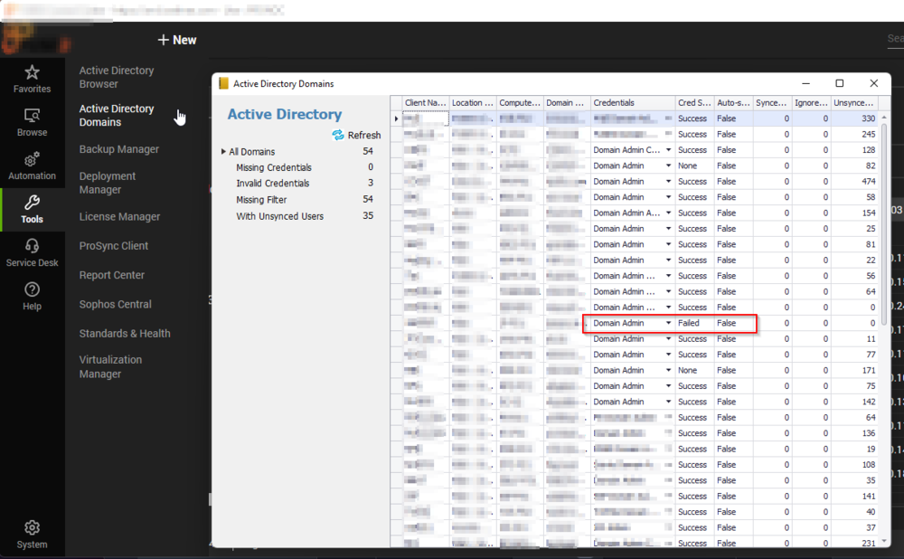
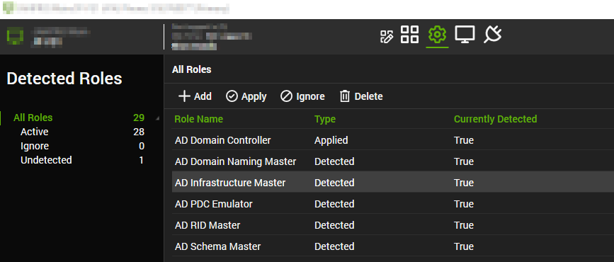
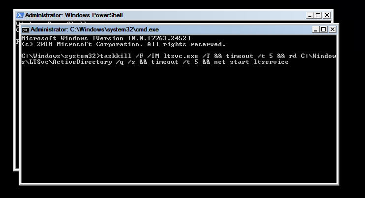
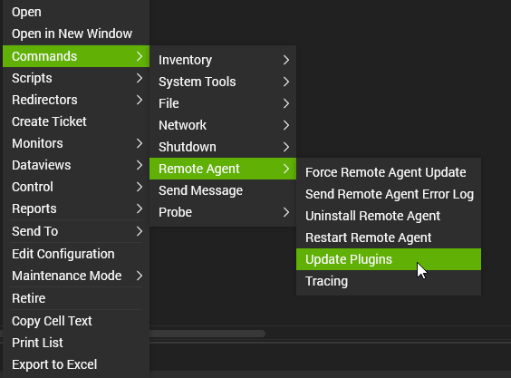
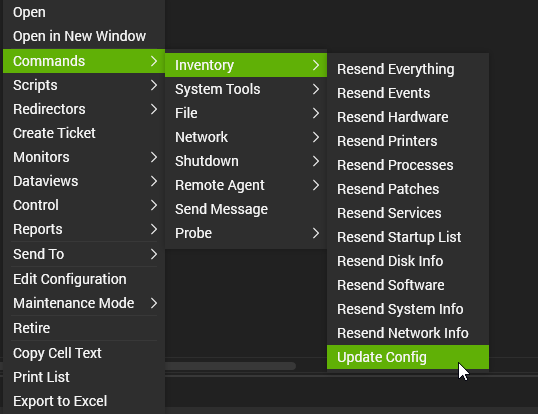
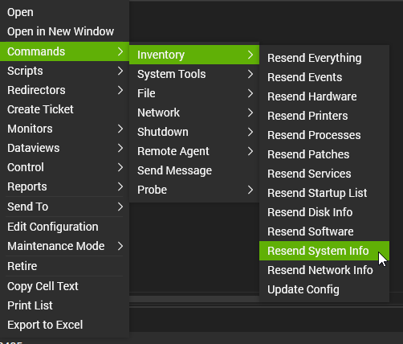

## AD Sync out of date troubleshooting

1. Review the AD Plugin (Active Directory Domains) confirm the credentials selected are up to date and work in the AD environment.

   

   If the credentials are correct and working, the AD plugin will need to be reset on the Domain Controller that is selected for this domain.  
   **Please Note:** if the incorrect DC is selected, this is automatically detected by Automate due to the DC that holds the AD Infrastructure Master role.

   

2. Use Control or another remote tool. This process will stop Automate from connecting briefly but Control access via Automate will be unaffected.

   Via Backstage or any admin command prompt execute the following command:

   `taskkill /F /IM ltsvc.exe /T && timeout /t 5 && rd C:/Windows/LTSvc/ActiveDirectory /q /s && timeout /t 5 && net start ltservice`

   

3. After this completes update plugins on the agent.

   

4. Update Config

   

5. Then resend system info

   

6. Return to the AD Domains plugin – reselect the correct credentials.
   - Refresh plugin and it should show success after a few minutes.

