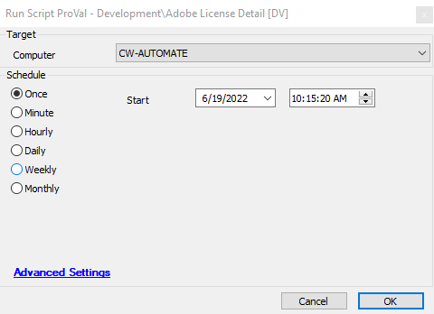

## Summary

This script collects the Adobe license key and stores it in the custom EDF "Adobe License Key".

## Sample Run

## Dependencies

[Adobe License Detection](https://proval.itglue.com/DOC-5078775-10218266)

## Variables

| Name                | Description                             |
|---------------------|-----------------------------------------|
| Output              | This variable stores the Adobe License Key |
| Adobe License Key   | EDF which store the License key        |

## Process

This script can run on any Windows agent. It first checks whether the agent has the Adobe product or not. If yes, then the script downloads the "sqlite3.exe" file from URL ([https://bitbucket.org/provaltech/downloads/downloads/sqlite3.exe](https://bitbucket.org/provaltech/downloads/downloads/sqlite3.exe)) and executes it. Also, it runs the PowerShell script to fetch the Adobe License key and then stores it in EDF. This shows the same in the dataview.

## Output

- Script log
- EDF
- Dataview

