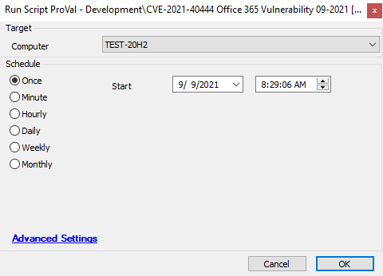

## Summary

This script will perform mitigation on the agent to import the provided registry as detailed in the article below.

[Microsoft Shares Temp Fix for Ongoing Office 365 Zero-Day Attacks](https://www.bleepingcomputer.com/news/security/microsoft-shares-temp-fix-for-ongoing-office-365-zero-day-attacks/amp/?__twitter_impression=true)

**Time Saved by Automation:** 10 Minutes

## Sample Run

## Dependencies

- [CVE-2021-40444 Office 365 Detection](<./CVE-2021-40444 Office 365 Detection.md>)
- [CVE-2021-40444 Office 365 Vulnerability Report](<./CVE-2021-40444 Office 365 Vulnerability Report.md>)

## Variables

| Variable         | Description                                            |
|------------------|--------------------------------------------------------|
| scriptcount      | Tracks the number of attempts the script made to reboot the agent |
| MitigationStatus  | Records whether mitigation has been applied or not    |
| ScriptRanDate    | Tracks the last script execution date                  |
| ApprovedStatus    | Stores the reboot approval status                       |

#### Global Parameters

| Name   | Example | Required | Description                                                                                                                                         |
|--------|---------|----------|-----------------------------------------------------------------------------------------------------------------------------------------------------|
| Reboot | 0       | True     | Decides whether the script will perform a forced reboot, no reboot, or a user-interactive reboot (0 = user interactive reboot, 1 = forced reboot, 2 = no reboot) |

#### Script States

| Name                        | Example                                      | Description                                          |
|-----------------------------|----------------------------------------------|------------------------------------------------------|
| CVE-2021-40444_Office365   | 0 -- 12/09/2021 -- No User -- Mitigation Applied | Keeps a record of the script result                    |
| CVE-2021-40444             | @scriptcount@                               | The number of times the script has notified the end user to reboot the machine. |

## Process

- This script will download the .reg registry file from the following link: [Download Registry](https://download.bleepingcomputer.com/reg/disable-activex.reg)
- After downloading the registry file, it will import the registry to the endpoint.
- The reboot behavior is determined by the global parameter value: if set to 1, the machine will be forcefully rebooted. If set to 0, the script will proceed with a user-interactive reboot. If set to 2, no reboot will occur via the script.
- In the no reboot scenario, mitigation will be assumed as applied, as it will be implemented as soon as the system is rebooted.
- If no user is detected online, a force reboot will automatically trigger. If a user is found, the script will prompt for a reboot up to 5 times within a 10-hour window.
- After five continuous deny responses from the user, the machine will be forcefully rebooted.
- The user will receive a 5-minute warning before the force reboot to save their work.
- There is an option to not reboot and allow the user to handle the reboot during the patch cycle. To do this, set Reboot = 2.
- All actions will be logged in the script state and displayed in the dependent dataview for reporting.

## Output

- Script log
- Script state
- Dataview

