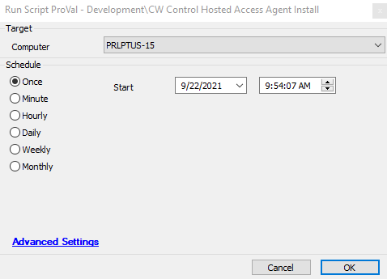
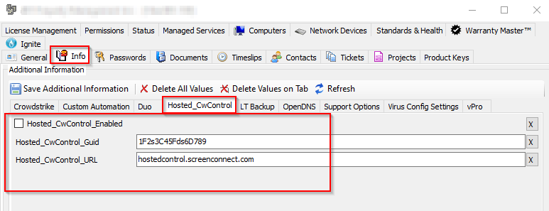
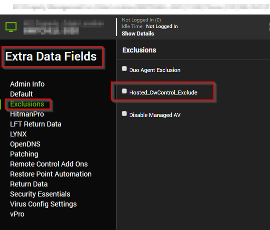
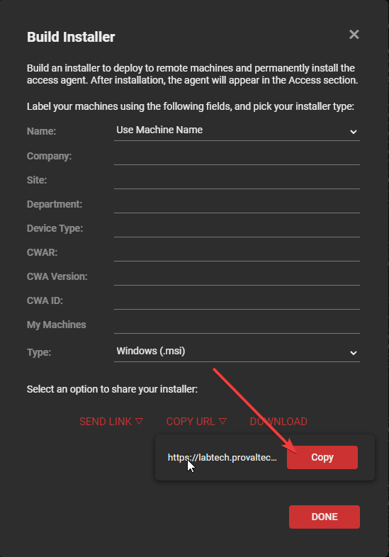

## Summary

This script will use the client level EDFs to download and install a CW Control agent on the system.

## Sample Run

## Dependencies

**Client Level EDF**  

**Agent Level EDF**  

## Variables

- `@Hosted_CW_Enabled@` - Client level EDF
- `@Hosted_CW_GUID@` - Client level EDF - contains the CWC GUID
- `@Hosted_CW_URL@` - Direct URL for the CWC MSI installer for the target instance. The URL will be a long string similar to:

[https://your.domain.com/Control/Bin/ConnectWiseControl.ClientSetup.msi?h=your.domain.com&p=8041&k=(long string of alphanumeric characters)&e=Access&y=Guest&t=&c=&c=&c=&c=&c=&c=&c=&c=](https://your.domain.com/Control/Bin/ConnectWiseControl.ClientSetup.msi?h=your.domain.com&p=8041&k=(long string of alphanumeric characters)&e=Access&y=Guest&t=&c=&c=&c=&c=&c=&c=&c=&c=)

You can get this string by pressing the  button and using these settings:

## Process

- Uses the client EDF to download the CW Control install MSI.
- Installs the downloaded MSI.
- Then uses the client EDF to verify that the correct GUID was installed.

## Output

**Script Log**

