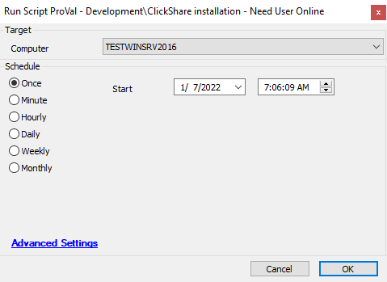

## Summary

This script will help to install the ClickShare.

## Sample Run

## Dependencies

[Download Link](https://www.barco.com/services/website/en/TdeFiles/Download?FileNumber=R3306183&TdeType=3&MajorVersion=04&MinorVersion=18&PatchVersion=00&BuildVersion=008&ShowDownloadPage=False)

#### Global Parameters

| Name          | Example | Required | Description                                                                                     |
|---------------|---------|----------|-------------------------------------------------------------------------------------------------|
| TaskSchedular | 0,1     | True     | 1 --> Schedule the task to install ClickShare for all users0 --> Install ClickShare to logged in user |

## Process

This script helps to install the Click Share on the agent. It can install the application to all users at once or to the logged-in user based on global parameter "TaskSchedular".

## Output

- Script log

