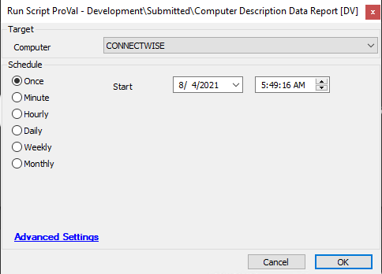

## Summary

This script will find the computer description information from the agent and store the information in the dependent dataview.  
**Time Saved by Automation:** 10 Minutes

## Sample Run

## Dependencies

[Computer Description Audit](/docs/81645955-50e9-45e6-b635-e6780aefc390)

## Script State

| Name                     | Example                                     | Description                                                             |
|--------------------------|---------------------------------------------|-------------------------------------------------------------------------|
| ComputerDescriptionReport | `@Powershell Output@ -- @Date of script execution@` | Represents the computer description message of an agent and the date when the script ran. |

## Process

- This script will check for the computer description information.
- If the computer description is not set, it will store "Computer Description Not Set" along with the date of script execution.
- Stores the information in the script state so that it can be reflected in the dataview.

## Output

- Script log
- Script state
- Dataview

