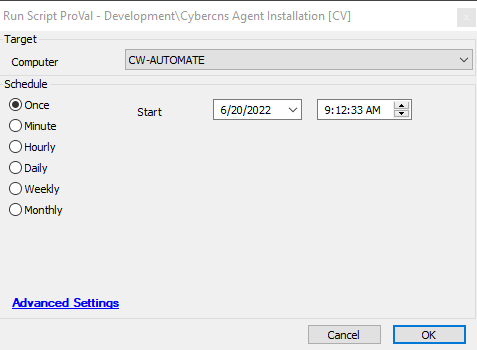

## Summary

This script installs the cybercns agent on a computer.

## Requirements

The Following Client Level EDFs must be set:
1. EDF Cybercns Company  
2. EDF Cybercns Client ID  
3. EDF Cybercns Client Secret  

The global variable `URL_Download` must have a valid download URL.

## Sample Run

## Variables

Document the various variables in the script. Delete any section that is not relevant to your script.

| Name                     | Description                                          |
|--------------------------|------------------------------------------------------|
| CyberCNS Company ID      | Client EDF- Store the value of cybercns company ID  |
| CyberCNS Client ID       | Client EDF- Store the value of cybercns Client ID   |
| CyberCNS Client Secret    | Client EDF- Store the value of the cybercns client secret |

## Global Parameter

| Name          | Example                          | Required | Description                                                    |
|---------------|----------------------------------|----------|----------------------------------------------------------------|
| URL_Download  | [https://cbercns.exe](https://cbercns.exe) | True     | This stores the cybercns exe package URL to proceed for installation. |

## Process

1. Retrieves the client level EDF values
2. If anything is missing it exits with error.
3. If all values are present, it downloads the installer using the `URL_Download` parameter
4. Once downloaded it installs the application
5. After execution it verifies the installation.

## Output

- Script log

