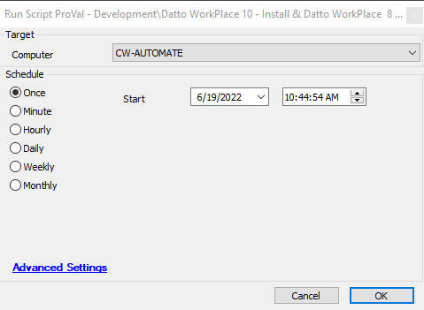

## Summary

This script will install Datto Workplace 10.3.0.281 and uninstall any other versions of Datto Workplace.

## Sample Run

## Dependencies

[Download Datto Workplace 10.3.0.281](https://us.workplace.datto.com/update/DattoWorkplaceSetup_v10.3.0.281.exe)

## Process

1. Check for installed Datto Workplace; if not installed, proceed with the installation.
2. Check if the currently installed version is 10.3.0.281; if so, exit. If not, continue.
3. Uninstall the old version.
4. Install the new version.

## Output

- Script log

