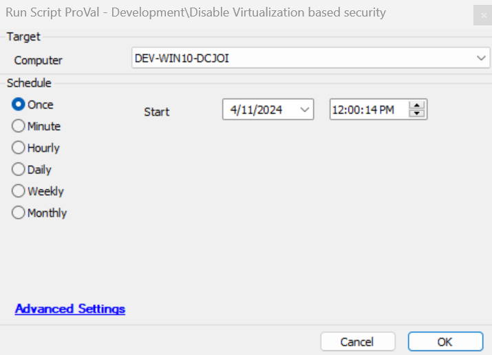

## Summary

This script will set the registry based on the below article:  
[https://windowsreport.com/disable-windows-defender-credential-guard-windows-11/](https://windowsreport.com/disable-windows-defender-credential-guard-windows-11/).  
Once the registry is set, it will set the machine to reboot using the prompter solution.

## Sample Run

## Dependencies

[EPM - Windows Configuration - Solution - User Prompt for Reboot](<../solutions/User Prompt for Reboot.md>)

## Variables

| Name  | Description                                    |
|-------|------------------------------------------------|
| psout | It contains the status of the registry set or not |

## Output

- Script log

