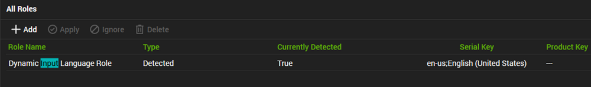

## Summary

This role shows the Windows where the input system like keyboard settings are set to which language.

This setting, also known as “input language”, determines the layout of the keyboard. For example, an English (United States) input locale will have a QWERTY layout, while a French (France) input locale will use an AZERTY layout. This means you can type in a language different from the display language used by your operating system. 

So, if your system locale is English (United States) and your input locale is French (France), your system will display text in English, but you’ll be typing with a French keyboard layout. This is common on multilingual systems or when users prefer a keyboard layout different from the default layout of their system language.

## Settings

| Detection String                                                                                                                                               | Comparator | Result                           | Applicable OS |
|----------------------------------------------------------------------------------------------------------------------------------------------------------------|------------|----------------------------------|----------------|
| \{@%C:/Windows/System32/WindowsPowerShell/v1.0/powershell.exe -ExecutionPolicy Bypass -Command "$locale = (systeminfo | findstr /B /C:'Input Locale') -replace 'Input Locale:',''; $locale.trim()"@%} | Exists     | en-us;English (United States)   | Windows        |

## Sample

