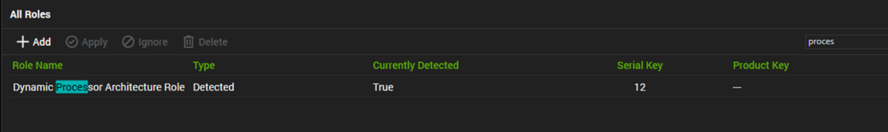

## Summary

This role gives the processor architecture info.

The role results numeric value whose meaning is written in the curly braces:

```
0 \{ x86 }
1 \{ MIPS }
2 \{ Alpha }
3 \{ PowerPC }
5 \{ ARM }
6 \{ Itanium-based systems (ia64) }
9 \{ AMD64 }
12 \{ ARM64 }
default \{ Unknown architecture }
```

## Settings

| Detection String                                                                                                                                                               | Comparator | Result      | Applicable OS |
|-------------------------------------------------------------------------------------------------------------------------------------------------------------------------------|------------|-------------|----------------|
| \{@%C:/Windows/System32/WindowsPowerShell/v1.0/powershell.exe -ExecutionPolicy Bypass -Command "Get-CimInstance -ClassName Win32_Processor | Select-Object -ExpandProperty Architecture"@%} | Exists     | 0,9,12, etc. | Windows        |

## Sample




