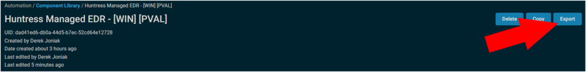
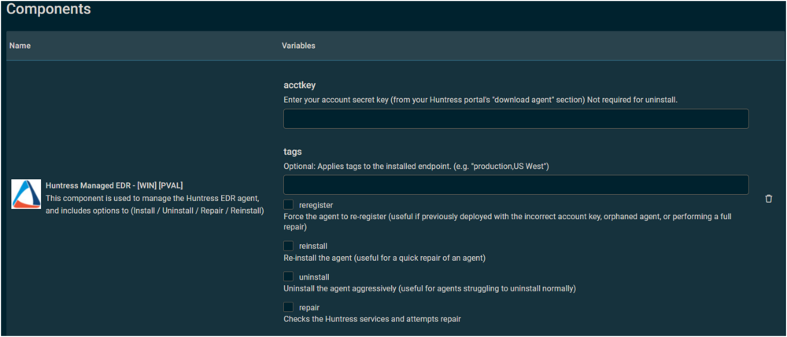
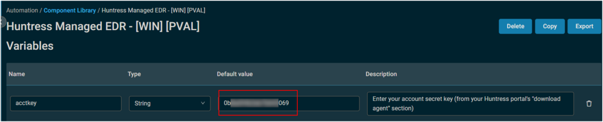
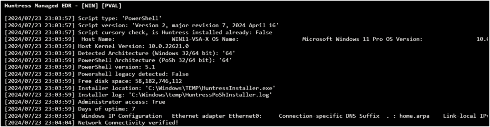
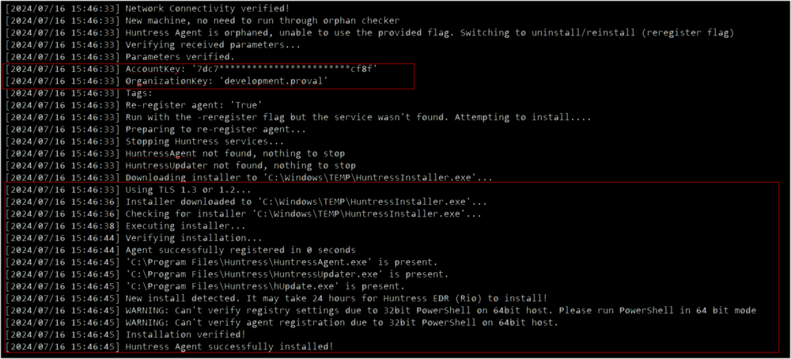

## Summary

This component is used to manage the Huntress EDR agent, and includes options to (Install / Uninstall / Repair / Reinstall)  

## Dependencies

- [Vendor PowerShell Script](https://raw.githubusercontent.com/huntresslabs/deployment-scripts/main/Powershell/InstallHuntress.powershellv2.ps1)
- A Huntress account key is required for install, the partner can refer to this [article](https://support.huntress.io/hc/en-us/articles/4404012734227-Using-Account-Keys-Organization-Keys-and-Agent-Tags)
- An organization key is required, but automatically populated from Datto Agent Variable: CS_PROFILE_NAME (The name of the site where this device is located.)

## Implementation

Export the component from ProVal's Datto RMM instance  
Name: Huntress Managed EDR - [WIN] [PVAL]  
  
The export will download the necessary component (cpt) file.  
  
Import this component file into the partner's Datto RMM instance  
  

Proval Plug & Play: This component requires no configuration once imported.

## Usage

The component will prompt for several variables during a job.  
  
**acctkey:** Enter your account secret key (from your Huntress portal's "download agent" section)  
This can pre-filled for the partner by providing a default value for the variable within the component within the partner's RMM.  
  

**tags:** Optional: Applies tags to the installed endpoint. (e.g. "production,US West")  
**reregister:** Force the agent to re-register (useful if previously deployed with the incorrect account key, orphaned agent, or performing a full repair)  
**reinstall:** Re-install the agent (useful for a quick repair of an agent)  
**uninstall:** Uninstall the agent aggressively (useful for agents struggling to uninstall normally)  
**repair:** Checks the Huntress services and attempts repair  

## Output

A job status of Success is expected.  
  

**StdOut**  
  
  
StdOut may require you to scroll to view the complete log, you can alternatively download the txt  
  

**StdErr**  
StdErr is not expected

