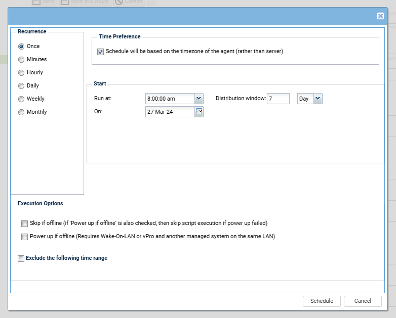

# Summary

The policy will run the update list by scan on all the machines for once.

# Dependencies

**View:** All Machines

# Details

- **Policy Name:** Update List By Scan - All Machines
- **Policy Description:** Update List By Scan - All Machines  
  T20241014.0109 - service monitor/restart request
- **Applied View:** All Machines
- **Assigned Organizations / Machine Groups:** Global Org
- **Assigned Machines:** **All Machines**

**Policy Objects Active**
- **Policy Object Name:** Update list by Scan
- **Policy Object Settings:** To run once at 8 AM with a 7 day distribution window

