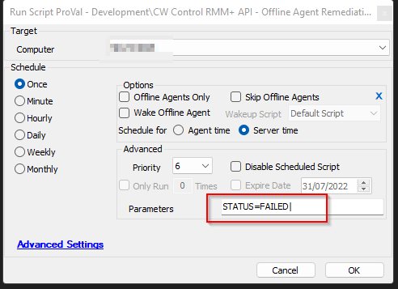

## Summary

This is an updated version of [CWM - Automate - Script - CW Control RMM+ API - Offline Agent Remediation [Autofix]](<../cwa/scripts/ScreenConnect - Offline Agent Remediation Autofix,RMM+.md>) script.

The script checks whether the agent is offline in both Automate and Control. If the agent is found to be online in Control, it will attempt to restart the agent service via the Control portal.

Additionally, the script has the functionality to create a ticket for offline servers as well as for broken agents. To enable the ticket creation feature, a ticket category ID should be set for the global variable **TicketCreationCategory**.

It is recommended to set the ticket category in the global variables before integrating this with the Offline Server Monitoring solution.

**Intended Target:** An autofix script for offline server monitoring.

## Sample Run

## Dependencies

- [CWM - Control - Script - CW Control RMM+ API - Execute Command](<../cwa/scripts/ScreenConnect Client - Command - Execute.md>)
- [CWM - Control - Script - CW Control RMM+ API - Is Online [Properties]](<../cwa/scripts/ScreenConnect Client - Connectivity - Audit.md>)
- [CWM - Automate - RMM+ Plugin Configuration](<../cwa/scripts/CWM - Automate - RMM+ Plugin Configuration.md>)

## Variables

| Name    | Description                                                 |
|---------|-------------------------------------------------------------|
| Online  | 1 or 0. Indicates the status of the computer in the CW Control portal. |
| Command | Agent restart command for each operating system.            |
| Subject | Subject of the ticket.                                     |
| Body    | Ticket body.                                              |
| Tickid  | Ticket ID of the existing ticket.                           |

## Global Variables

| **Name**                  | **Example** | **Required** | **Description**                             |
|---------------------------|-------------|--------------|---------------------------------------------|
| TicketCreationCategory     | 118         | True         | ID for the ticket category to be created in|

## System Properties

| Name                          | Example                         | Required | Description                                                                                   |
|-------------------------------|---------------------------------|----------|-----------------------------------------------------------------------------------------------|
| RMMPlus_AccessKey             | ajw8fh2p93ufn;o31ifu2091j23oif | True     | This is the key set up in the CW Control RMM+ Plugin so Automate can access the API.        |
| RMMPlus_Headers               | Origin: [site.site.com](http://site.site.com/) | True     | This is the URL (without http/https) for the CW Control server. This value must match the value in the RMM+ Plugin configuration in CW Control. |
| RMMPlus_StaleAgentThreshold   | 30                              | True     | The number of days to indicate what a "stale" agent is to the scripts. 30 is the default.   |
| RMMPlus_Timeout               | 1000                            | True     | The default timeout for commands run via RMM+ through Automate. 1000 is the default.       |

## Script States

| Name          | Example                  | Description                                                                                  |
|---------------|--------------------------|----------------------------------------------------------------------------------------------|
| AgentStatus   | Broken | Verified Offline | This script state is used for the dataview: [CWM - Automate - Dataview - Agent - Agent Check-in Over 30 Days](<../cwa/dataviews/Agent - Agent Check-in Over 30 Days.md>) and will display the results of this autofix. |

## Process

### For Failed Monitor Status:

This script will first run the [CWM - Control - Script - CW Control RMM+ API - Is Online [Properties]](<../cwa/scripts/ScreenConnect Client - Connectivity - Audit.md>) script to determine if the agent is online in CW Control.

If the agent is offline in both systems, the script will create an offline server ticket if **TicketCreationCategory** is defined; otherwise, it will exit with a log message stating that the agent is offline in both systems. This output will be recorded in the **AgentStatus** script state.

If the agent is found online in CW Control but offline in CW Automate, it will attempt to restart the Automate agent services on the target device.

The command will be issued via the [CWM - Control - Script - CW Control RMM+ API - Execute Command](<../cwa/scripts/ScreenConnect Client - Command - Execute.md>) script. A command based on the OS type will be issued.

After issuing the command to restart the services, the script will check for 15 minutes to see if the agent checks back in successfully in Automate. If the agent is found, the script will exit with success and clear the **AgentStatus** script state from the target device.

If it does not find a match, it will create a broken agent ticket if **TicketCreationCategory** is defined; otherwise, it will output a log message stating that the agent is "broken" and needs to be reinstalled manually or reviewed by a technician. The script will update the **AgentStatus** script state to indicate that the agent is "broken" and needs to be reinstalled. This data is visible in the [CWM - Automate - Dataview - Agent - Agent Check-in Over 30 Days](<../cwa/dataviews/Agent - Agent Check-in Over 30 Days.md>) info dataview.

**Offline Server Ticket Description:**
- Ticket Subject: LT - Server Offline for %Clientname%/%ComputerName% (%Computerid%)
- Ticket Body: Server Offline Alert for %ComputerName% (%Computerid%) at %Clientname%. Last contact was @Result@

**Broken Agent Ticket Description:**
- Ticket Subject: LT - Broken Agent Detected for %Clientname%/%ComputerName% (%Computerid%)
- Ticket Body: Server %ComputerName% (%Computerid%) at %Clientname% is offline in Automate, but Control is working fine. An autofix attempt to restart the Ltechagent service was made from Automate, but it failed. Please check it out manually.

The script prefers adding a comment in a new or existing ticket rather than creating a new ticket every time.

### For Success Monitor Status:

The script will clear the **AgentStatus** script state and finish any open offline server or broken agent ticket for the computer.

## Output

- Script Log
- Script State
- Ticket
