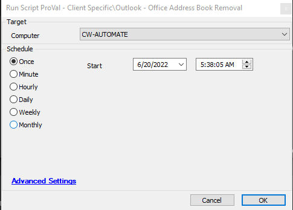

## Summary

This script will remove and reset the 'Offline Address Books' folder for all users.

## Sample Run

## Variables

| Name | Description |
|------|-------------|
| OAB  | This contains the offline address book reset information |

## Process

The script will remove and reset the 'Offline Address Books' folder located at the path `C:/Users/@everyuser@/AppData/Local/Microsoft/Outlook/Offline Address Books`.

## Output

- Script log

