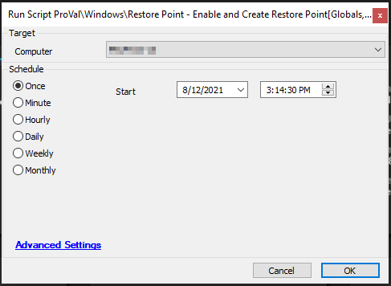

## Summary

This script checks if system restore is enabled on the system drive. If it is not enabled, the script will enable system restore and set the maximum storage space used by system restore to 5%.

It later checks if a system has a restore point created within the last 30 days (the default is set to 30 in global parameters). If no restore point exists, it will create a manual restore point. The script will also create a ticket if it fails to create a manual restore point, provided the global parameter "Createticket" is set to 1 (by default, ticket creation is disabled).

**Time Saved by Automation:** 10 Minutes

## Sample Run

## Dependencies

- Windows Workstation OS

## Variables

Document the various variables in the script. Delete any section that is not relevant to your script.

### Global Parameters

| Name         | Example | Required | Description                   |
|--------------|---------|----------|-------------------------------|
| daystocheck  | 30      | True     | Number of days to check for restore points |

### User Parameters

| Name                           | Example                        | Required     | Description                   |
|--------------------------------|--------------------------------|--------------|-------------------------------|
| The name of the parameter      | An example value of the parameter | True or False | Description of the parameter   |

### System Properties

| Name                           | Example                        | Required     | Description                   |
|--------------------------------|--------------------------------|--------------|-------------------------------|
| The name of the property       | An example value of the property | True or False | Description of the property    |

### Script States

| Name                           | Example                        | Description                   |
|--------------------------------|--------------------------------|-------------------------------|
| The name of the Script State   | An example of the Script State | Description of the script state |

## Process

Describe the steps the script performs to accomplish the desired task. Note that if this script is just a front-end for a piece of Agnostic Content, you can insert a link to the documentation for that content here instead.

## Output

The location and method by which this script returns data.

Examples:

- Script log
- Script state
- Local file on computer
- Dataview
- etc.
