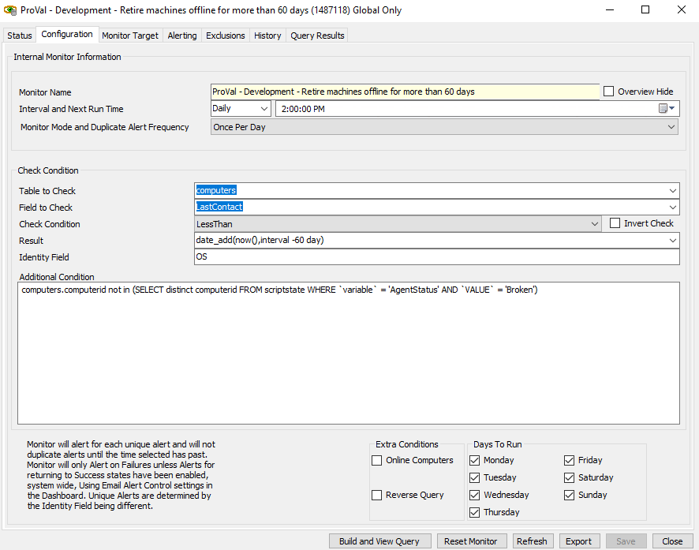
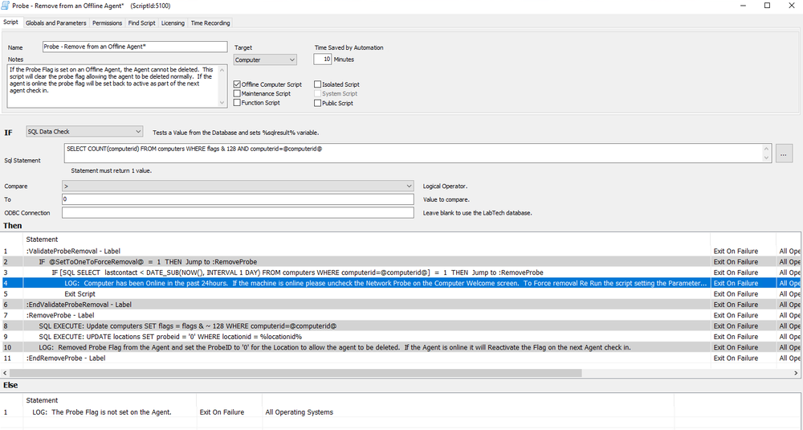
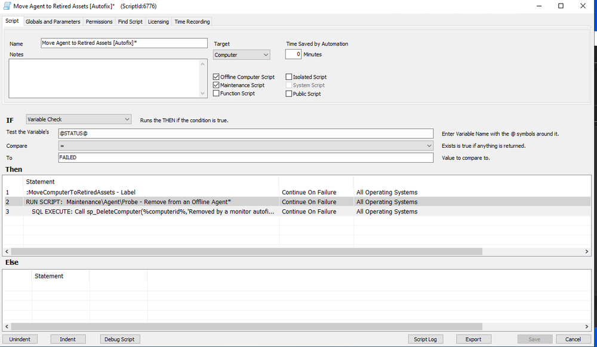

<div class='text-section scrollable'>

**Important:**

This monitor should be created only after the client's approval.

The prerequisite step before retiring the machine is to run the RMM+ autofix, which attempts to fix the broken agents in the environment.

Reference monitor set: ProVal - Development - Retire machines offline for more than 60 days

</div>

## Monitor Set

<div class='text-section scrollable'>

Monitor set details:

Please use the configuration below or modify it as per client requirements:



Verify by clicking on the build and viewing the query to see these machines.

</div>

## Autofix Script

<div class='text-section scrollable'>

The autofix script to remove the machines should consist of two parts:

1. Check if the enlisted machine is a probe; if yes, remove it as a probe.
2. Then execute the SQL command to retire all these machines and move them to the retired asset tab.

The first script can be as follows:



The second script can be as follows:



SQL:

```
Call sp_DeleteComputer(%computerid%, 'Removed by a monitor autofix on %when%')
```

</div>

## Reference Monitor/Script in Our Environment

<div class='text-section scrollable'>

Monitor: "ProVal - Development - Retire machines offline for more than 60 days"

Note: Remove the AND query at the end to limit to only 30 years. If you see machines that have the last contact listed as "0001," make sure to remove the 30-year limit and then save the monitor in the client's environment.

Script 1: "Probe - Remove from an Offline Agent"

Folder: "Agent"

Script 2: "Move Agent to Retired Assets [Autofix]"

Folder: ".Monitor Autofixes"

</div>


