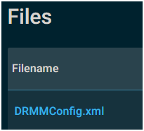
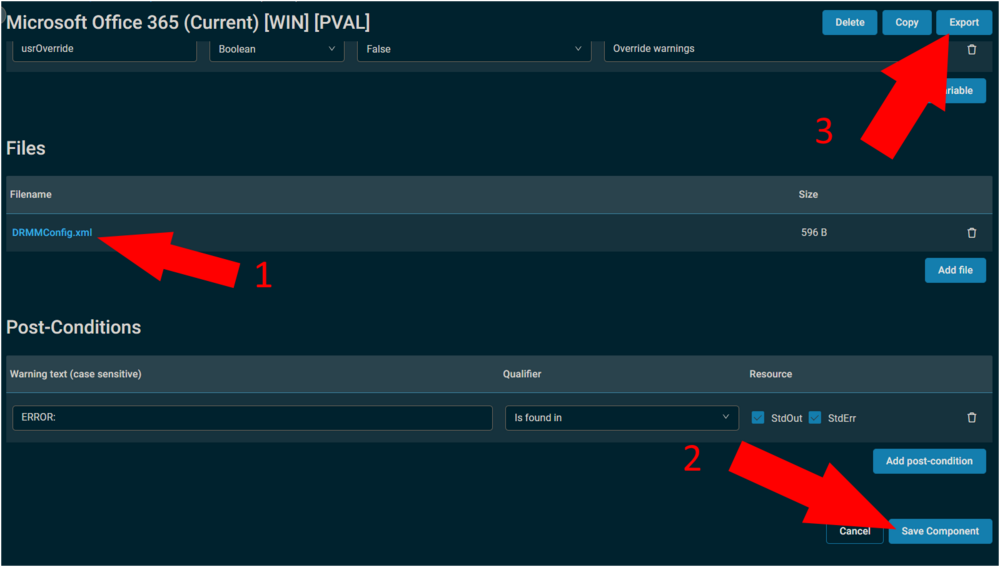

# Overview

Installs or updates Microsoft Office 365 on the current channel. Utilizes a preconfigured DRRMConfig.xml to configure the application.

**Requirements**
- PowerShell 5+
- Windows 10+ / Server 2016+
- Must be run as an Administrator

# Process

1. Run the Comstore component: **Microsoft Office 365 Configuration Tool [WIN]** to generate a configuration XML file that the Office 365 installer Component will utilize. Running the installer without this configuration XML will cause the Component to use default settings.
2. Run the Comstore component: **Microsoft Office 365 (Current) [WIN]** which will use the `C:/Windows/Temp/OfficeInstall/DRMMConfig.xml` file generated by the configuration tool.

# Datto RMM Implementation

If the XML has already been preconfigured, and needs to be deployed, the Comstore component can be modified and deployed to the client.

In this circumstance, use the following modified component: **Microsoft Office 365 (Current) [WIN] [PVAL]** and replace the XML file within the component with your XML.



Once the file has been replaced, save the component, and export it.  


# Example Usage

```
Microsoft Office 365 (Current) [WIN] [PVAL]

    Directory: C:/Windows/Temp

Mode                     LastWriteTime         Length Name
----                     -------------         ------ ----
d-----                   6/17/2024  10:26 AM          OfficeInstall
Software: Microsoft Office 365 :: Monthly Channel
=========================================================
- Microsoft Office was not detected on this device.
- Pre-defined XML from Office 365 Config Component detected.
  Deployment parameters are:
: Edition:     O365BusinessRetail
: Bitness:     64-bit
: Channel:     Current
: Lang ID/s:   en-us
: Exclusion/s: Groove,Lync
: Company:     
=========================================================
- Downloading: [https://www.microsoft.com/en-us/download/confirmation.aspx?id=49117](https://www.microsoft.com/en-us/download/confirmation.aspx?id=49117)
- Downloaded:  ODTLink.html
- Downloading: [https://download.microsoft.com/download/2/7/A/27AF1BE6-DD20-4CB4-B154-EBAB8A7D4A7E/officedeploymenttool_17531-20046.exe](https://download.microsoft.com/download/2/7/A/27AF1BE6-DD20-4CB4-B154-EBAB8A7D4A7E/officedeploymenttool_17531-20046.exe)
- Downloaded:  ODTool.exe
- Digital Signature verification passed.
- Running Office Deployment Tool with pre-configured parameters...
- Microsoft Office 365 setup has been initiated.
  It may take a long time for visible signs to show on the endpoint.
```

# Parameters

| **Parameter**       | **Alias** | **Required** | **Default** | **Type**  | **Description**        |
|---------------------|-----------|--------------|-------------|-----------|-------------------------|
| `-usrOverride`      |           | False        |             | Boolean   | Override warnings       |

**Output**  
Location of output for log, result, and error files.

```
StdERR / StdOut
```


