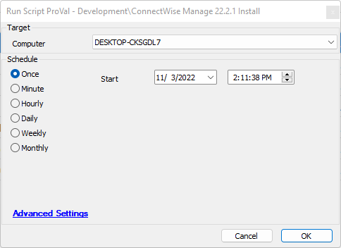

## Summary

This document outlines the process to install or upgrade the current ConnectWise Manager Internet Client to version 22.2.1 if necessary.

## Sample Run

## Dependencies

- The following link must remain valid: [ConnectWise Manager Internet Client x64 MSI](https://university.connectwise.com/install/2022.2.1/ConnectWise-Manage-Internet-Client-x64.msi).

## Variables

| Name            | Description                                                                                     |
|-----------------|-------------------------------------------------------------------------------------------------|
| InstallerName   | The name of the MSI installation file.                                                         |
| LocalPath       | The location, including the file name, for where we will place the MSI.                       |
| DownloadUrl     | The download URL to obtain the MSI file.                                                      |
| Install         | A true or false value that reflects the answer to the question: Do we need to install?        |
| StatusMessage    | Variable to store current process state log messages.                                          |

#### Global Parameters

| Name           | Example | Required | Description                                                                                                                                              |
|----------------|---------|----------|----------------------------------------------------------------------------------------------------------------------------------------------------------|
| TargetVersion  | 22.2.1  | True     | This variable represents the target version you wish to be at and is used to formulate the Download URL variable, as well as a comparison value when looking at the current installed product version. |

## Process

1. Create a temporary directory to hold the installer if one doesn't exist.
2. Compare the currently installed version to the target version. If the currently installed version is greater than or equal to the target version, log that no installation is necessary and exit.
3. Download the file.
4. Execute the installation.
5. Resend the software list.
6. Check for the ConnectWise Manage Client 64-bit. If it is not present, delete the temporary file, log the state, and exit with an error.
7. Delete the temporary file.
8. Log success and exit.

