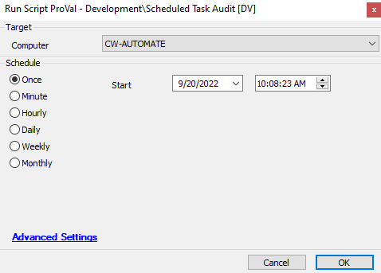

## Summary

This script audits scheduled tasks to identify which user accounts are running them.

## Sample Run

## Variables

| Variable           | Description                                                                                     |
|--------------------|-------------------------------------------------------------------------------------------------|
| ProjectName        | Project name where the script will store its work                                              |
| JsonFileName       | The name of the JSON file where script data is stored                                          |
| TableName          | The name of the table where the script data will be stored after converting from the JSON file |
| WorkingDirectory    | The directory where the project file and the JSON file are stored                             |
| SQLDeleteStatement  | The SQL statement used to clear data from the table for the computer ID                        |
| SQLStartStatement   | The SQL statement used to insert data, excluding duplicates                                    |

## Dependencies

- [Scheduled Task Audit](<./Scheduled Task Audit.md>)
- [plugin_proval_scheduled_tasks](<./plugin_proval_scheduled_tasks.md>)
- [CWM - Automate - Script - OverFlowedVariable - SQL Insert - Execute](<../cwa/scripts/OverFlowedVariable - SQL Insert - Execute.md>)

## Process

This script creates a table named "plugin_proval_scheduled_tasks" to store the scheduled task details. It then creates a PowerShell script (ps1 file) at the path "C:/ProgramData/_automation/script/@ProjectName@/ScheduledTaskAudit.ps1". The script is executed using a shell command, and the data is stored in a JSON file. Finally, the JSON file is converted and pushed into the table.

## Output

- Script log
- plugin_proval_scheduled_tasks
- Data view
- etc.

