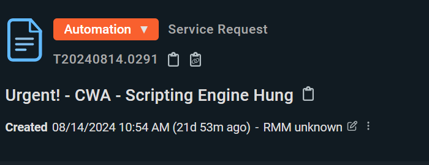
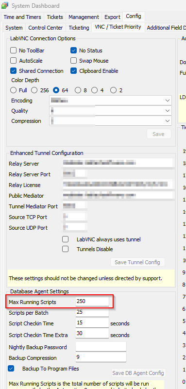
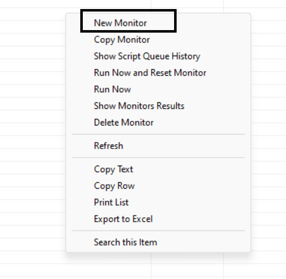
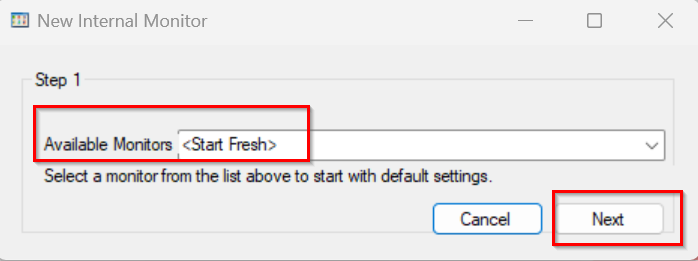
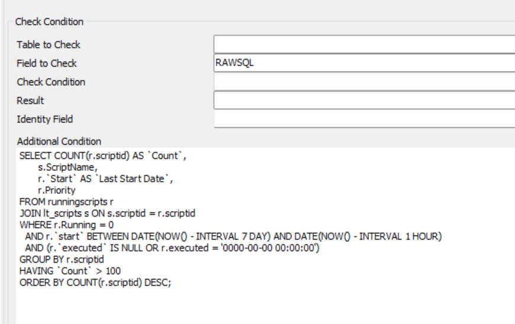
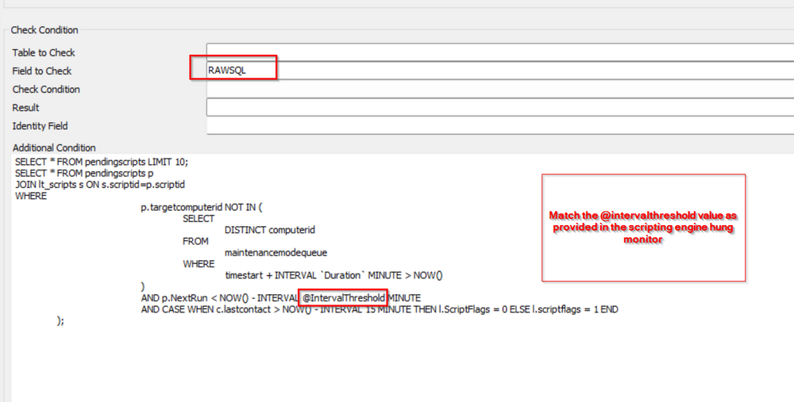
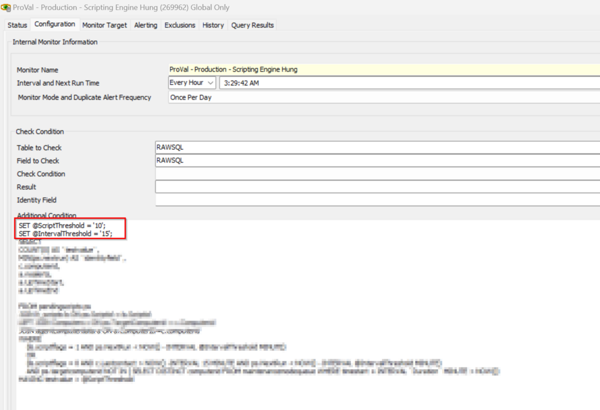

## Run a query

## Example Ticket



When you see a ticket like the above for any partner please follow the below troubleshooting steps.

### 1.
Navigate to the System >> VNC / Ticket Priority >> MAX Running Scripts

Look for the "MAX Running Scripts" and ensure its value is at least 1/3 of the value of its agent count.  
This applies only to the environment where you have seen frequent Scripting Engine Hung issues.  
This is not a stated statement; rather, it is being assumed to prevent situations in the partner environment if they continuously encounter Scripting engine crash issues.



Navigate to the System >> Configuration >> Dashboard >> Config >> Configuration >> Properties

Look for the property "LT_MAXRunningScripts" and ensure its value is reflected.

### 2.
Navigate to the Automation >> Monitor >> Internal Monitor

### 3.
Right-click and select the "New Monitor"



### 4.
Start Fresh >> Next



### 5.
Run the query as mentioned below:



```
SELECT COUNT(r.scriptid) AS `Count`,
       s.ScriptName,
       r.`Start` AS `Last Start Date`,
       r.Priority
FROM runningscripts r
JOIN lt_scripts s ON s.scriptid = r.scriptid
WHERE r.Running = 0
  AND r.`start` BETWEEN DATE(NOW() - INTERVAL 7 DAY) AND DATE(NOW() - INTERVAL 1 HOUR)
  AND (r.`executed` IS NULL OR r.executed = '0000-00-00 00:00:00')
GROUP BY r.scriptid
HAVING `Count` > 10
ORDER BY COUNT(r.scriptid) DESC;
```

Export the list to share with the consultant.  
Check for the top scripts whose running count is too much figure out why it has been running like that and fix it if found irrelevant.  
Bring the concern to the consultant with the note point and screenshots.

### 6.
Run another query  
Follow steps 2-4, then run the below query:





```
SELECT
      COUNT(0)
FROM
      pendingscripts p
      JOIN lt_scripts l ON p.scriptid = l.scriptid
      JOIN computers c ON p.targetcomputerid = c.computerid
WHERE
      p.targetcomputerid NOT IN (
            SELECT
                  DISTINCT computerid
            FROM
                  maintenancemodequeue
            WHERE
                  timestart + INTERVAL `Duration` MINUTE > NOW()
      )
      AND p.NextRun \< NOW() - INTERVAL 15 MINUTE
      AND CASE WHEN c.lastcontact > NOW() - INTERVAL 15 MINUTE THEN l.ScriptFlags = 0 ELSE l.scriptflags = 1 END
```

Please validate the stuck scripts and get that report exported to Excel to forward to the consultant with your feedback and review analysis reporting.

### 7.
**Only if the scripting engine appears to be hung with a lot of scripts reporting in the queue**, Restart the DB Agent service

Navigate to Help >> Server Status >> Restart Database Agent

This will remove all queued scripts and will fix the script engine hung temporarily if the script queuing issue is not fixed from the above query results.


