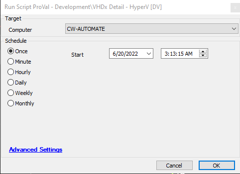

## Summary

This script collects information on all VHDX type disks on a Hyper-V server and stores this information in a script state.

## Sample Run

## Dependencies

[Hyper-V Virtual Harddisk Audit](https://proval.itglue.com/DOC-5078775-10218220)

## Variables

| Name       | Description                               |
|------------|-------------------------------------------|
| vhddetail  | This contains the VHDX information of Hyper-V |

#### Script States

| Name                     | Example                         | Description                                      |
|--------------------------|---------------------------------|--------------------------------------------------|
| HyperV-VhdxAudit@loop@  | HyperV-VhdxAudit1, HyperV-VhdxAudit2... | This contains all VHDX drive information from Hyper-V |

## Process

This script runs only on Hyper-V servers. It collects all VHDX information and stores it in the script state.

## Output

- Script log
- Script state
- Data view
