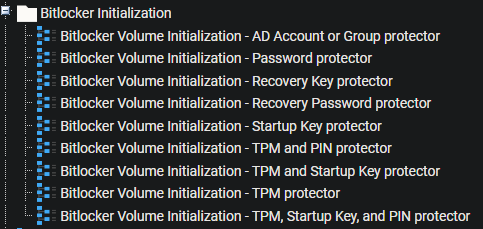
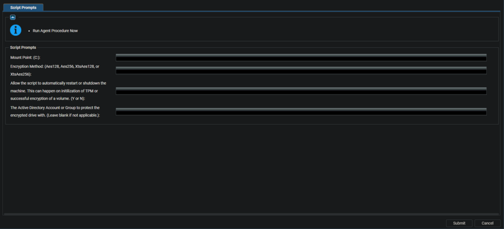

## Overview

The BitLocker Initialization folder in the Kaseya VSA contains a set of Agent Procedures that automate the process of encrypting a drive using the `Initialize-BitLockerVolume.ps1` PowerShell script. This guide will help you understand how to choose the right Agent Procedure and customize the parameters to meet specific requirements.

## Requirements

- PowerShell v5

## Instructions

1. Log in to the Kaseya VSA web interface.
2. Navigate to the "BitLocker Initialization" folder under Agent Procedures.
3. Review the available Agent Procedures and choose the one that fits your desired key protector configuration.
4. Run the chosen Agent Procedure to modify its parameters.
5. Customize the parameters according to your requirements.
6. Submit the parameters to run the Agent Procedure on the desired target machines.

## Agent Procedure Descriptions



1. **BitLocker Volume Initialization - AD Account or Group protector:** Encrypts the target volume using an Active Directory Account or Group as a key protector.
2. **BitLocker Volume Initialization - Password protector:** Encrypts the target volume using a custom password as a key protector.
3. **BitLocker Volume Initialization - Recovery Key protector:** Encrypts the target volume using a recovery key stored in an external drive as a key protector.
4. **BitLocker Volume Initialization - Recovery Password protector:** Encrypts the target volume using a recovery password as a key protector.
5. **BitLocker Volume Initialization - Startup Key protector:** Encrypts the target volume using a startup key stored in an external drive as a key protector.
6. **BitLocker Volume Initialization - TPM and PIN protector:** Encrypts the target volume using the TPM chip and a custom PIN as key protectors.
7. **BitLocker Volume Initialization - TPM and Startup Key protector:** Encrypts the target volume using the TPM chip and a startup key stored in an external drive as key protectors.
8. **BitLocker Volume Initialization - TPM protector:** Encrypts the target volume using only the TPM chip as a key protector.
9. **BitLocker Volume Initialization - TPM, Startup Key, and PIN protector:** Encrypts the target volume using the TPM chip, a startup key stored in an external drive, and a custom PIN as key protectors.

## Parameter Customization

In the Agent Procedure parameters, you can customize settings such as the target volume, encryption method, and key protector-related settings. Modify these parameters to meet your organization's security policies and requirements. Depending on the agent procedure selected, different options will be presented. The full list of parameters is provided below for reference, but only the options needed for the selected procedure will be presented when run.



*(Reference Image: **BitLocker Volume Initialization - AD Account or Group protector parameters**)*

Ensure you understand the implications of your chosen key protector configuration, as it impacts the security and accessibility of the encrypted drive.

After customizing and running the Agent Procedure, the `Initialize-BitLockerVolume` PowerShell script will be executed on the target machines, encrypting the specified volume with the chosen settings.

| Parameter                     | Required | Default                      | Type        | Description                                                                                                                                                                   |
|-------------------------------|----------|------------------------------|-------------|-------------------------------------------------------------------------------------------------------------------------------------------------------------------------------|
| `MountPoint`                  | False    | `$env:SystemDrive`           | String      | The target volume to enable BitLocker encryption against. Should be in the format `<driveletter>` or `<driveletter>:`. If a path is passed, the drive of that path will be attempted to be parsed. Defaults to `$env:SystemDrive`. |
| `EncryptionMethod`            | False    | "Aes256"                     | String      | The method of encryption to use for BitLocker. Valid options are Aes128, Aes256, XtsAes128, or XtsAes256. Defaults to Aes256.                                             |
| `AllowTPMInit`                | False    | False                        | Switch      | Allow the script to attempt initialization of TPM if necessary. Will require a reboot if TPM needs to be initialized.                                                      |
| `AllowRestart`                | False    | False                        | Switch      | Allow the script to automatically restart or shut down the machine. This can happen on initialization of TPM or successful encryption of a volume.                          |
| `TpmProtector`                | True     |                              | Switch      | Protect the encrypted drive with only the TPM chip.                                                                                                                         |
| `TpmAndPinProtector`          | True     |                              | Switch      | Protect the encrypted drive with the TPM chip and a PIN. Requires the -Pin parameter to be passed.                                                                          |
| `TpmAndStartupKeyProtector`   | True     |                              | Switch      | Protect the encrypted drive with the TPM chip and a startup key. Requires the -Path parameter to be passed.                                                                  |
| `TpmAndPinAndStartupKeyProtector` | True |                              | Switch      | Protect the encrypted drive with the TPM chip, a PIN, and a startup key. Requires the -Pin and -Path parameters to be passed.                                              |
| `PasswordProtector`           | True     |                              | Switch      | Protects the encrypted drive with a custom password. Requires the -Password parameter to be passed.                                                                          |
| `StartupKeyProtector`         | True     |                              | Switch      | Protect the encrypted drive with a startup key. Requires the -Path parameter to be passed.                                                                                  |
| `RecoveryKeyProtector`        | True     |                              | Switch      | Protect the encrypted drive with a recovery key. Requires the -Path parameter to be passed.                                                                                 |
| `RecoveryPasswordProtector`   | True     |                              | Switch      | Protect the encrypted drive with a recovery password. If the -RecoveryPassword parameter is not passed, the script will generate one automatically.                          |
| `AdAccountOrGroupProtector`   | True     |                              | Switch      | Protect the encrypted drive with an Active Directory Account or Group. Requires the -AdAccountOrGroup parameter to be passed.                                               |
| `Pin`                         | True     |                              | SecureString| The PIN to use in conjunction with TPM to protect the encrypted drive.                                                                                                     |
| `Path`                        | True     |                              | String      | The path to the external drive to save the startup or recovery key to.                                                                                                     |
| `Password`                    | True     |                              | SecureString| The password to set on the encrypted drive.                                                                                                                                 |
| `RecoveryPassword`            | False    |                              | String      | The recovery password to set on the encrypted drive. Must be in the following format: 000000-000000-000000-000000-000000-000000-000000-000000.                             |
| `AdAccountOrGroup`            | True     |                              | String      | The Active Directory Account or Group to protect the encrypted drive with.                                                                                                  |
| `SkipHardwareTest`           | False    |                              | Switch      | Use this switch to skip the hardware test for BitLocker, removing the need for a reboot of the system before encryption.                                                    |

## Process

When run, the agent procedure will call the `Initialize-BitLockerVolume.ps1` script. The script takes multiple switches that determine the type of encryption that will be implemented. The script will first validate the following items:

- If the protection status of the drive is currently "On," then the script will print the current status and encryption percentage and exit.
- If the BitLocker volume is currently suspended, then protection will be resumed.
- If the BitLocker volume currently has an encryption or decryption process running against it, then it will exit and prompt the operator to re-run the script after the process finishes.
- If all of the above checks pass and there is still a key protector (or multiple key protectors) installed, then it/they will be removed.

The script will then check for an existing TPM chip.

If a TPM chip exists, then the script will validate that the chip is initialized. If `-AllowTPMInit` is passed, the chip will be initialized if it is not already. If `-AllowRestart` was passed, then the computer will be shut down or rebooted based on the requirements of the TPM initialization.

If a TPM chip is not found and `-TpmProtector`, `-TpmAndPinProtector`, `-TpmAndStartupKeyProtector`, or `-TpmAndPinAndStartupKeyProtector` were passed, then the script will exit with an error.

Otherwise, if a TPM chip is not found, the script will continue. The drive will be encrypted based on the passed switches.

If a recovery password was installed, then an attempt to back it up to the AD will be made.

If `-AllowRestart` was passed, then the computer will be rebooted to complete the encryption process if `-SkipHardwareTest` was not passed.

## Payload Usage

Examples are shown below of how the agent procedure passes the parameters to the script.

Encrypts the E: volume with a password protector using Aes128. Will initialize TPM if needed and reboot the computer after completion.
```
./Initialize-BitLockerVolume.ps1 -MountPoint E: -EncryptionMethod Aes128 -PasswordProtector -Password (ConvertTo-SecureString -String 'P@$sw0rD!' -AsPlainText -Force) -AllowTPMInit -AllowRestart
```

Encrypts the `$env:SystemDrive` volume with a TPM protector using Aes256. If TPM is not initialized, the script will exit. Will reboot the computer after completion.
```
./Initialize-BitLockerVolume.ps1 -Tpm -AllowRestart
```

Encrypts the `$env:SystemDrive` volume with a Startup key protector using Aes256 to E:/Recovery. Will initialize TPM if needed. Will reboot the computer after completion.
```
./Initialize-BitLockerVolume.ps1 -StartupKeyProtector -Path E:/Recovery -AllowTPMInit -AllowRestart
```

## Logs

The following logs are created when the agent procedure is run.

```
./Initialize-BitLockerVolume-log.txt
./Initialize-BitLockerVolume-data.txt
./Initialize-BitLockerVolume-error.txt
```

