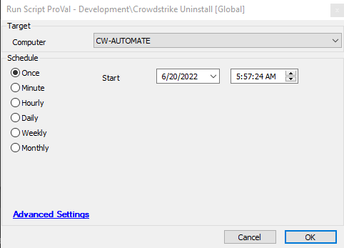

## Summary

This document provides a script to uninstall the CrowdStrike Application.

## Requirements

1. The file `CSUninstallTool.exe` must be placed in the `LTShare` directory in `Software/Crowdstrike`.

   This file is required to be downloaded from the Falcon site. Refer to the link below:

   [Download the CrowdStrike Falcon Sensor Windows Uninstall Tool](https://www.dell.com/support/kbdoc/en-in/000126140/how-to-download-the-crowdstrike-falcon-sensor-windows-uninstall-tool)

## Sample Run

## Dependencies

- `CSUninstallTool.exe` – Required file

#### Global Parameters

| Name             | Example | Required | Description                  |
|------------------|---------|----------|-------------------------------|
| TicketCreation    | 1 or 0  | False    | 1 - Ticket Created, 0 - No Ticket |

## Process

1. Verify that CrowdStrike is installed.
2. Download the removal tool.
3. Execute the removal of the application.
4. Verify that it was removed.
5. Create tickets based on results.

## Output

- Script log

