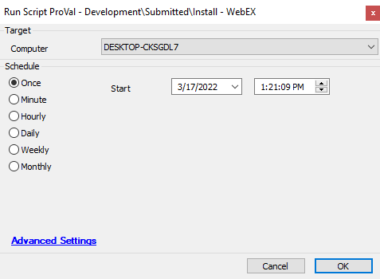

## Summary

This script installs WebEx from the Webex website.

## Sample Run

## Dependencies

This should be a list of ITGlue documents listed in the Related Items sidebar on which this script depends.

- Agnostic Content Doc Link
- Custom Table Doc Link
- EDF Doc Link
- etc.

## Variables

Document the various variables in the script. Delete any section that is not relevant to your script.

| Name                          | Description                     |
|-------------------------------|---------------------------------|
| The name of the variable      | What the variable represents    |

### Global Parameters

| Name                          | Example                          | Required       | Description                     |
|-------------------------------|----------------------------------|----------------|---------------------------------|
| The name of the parameter     | An example value of the parameter| True or False  | What the parameter represents    |

### User Parameters

| Name                          | Example                          | Required       | Description                     |
|-------------------------------|----------------------------------|----------------|---------------------------------|
| The name of the parameter     | An example value of the parameter| True or False  | What the parameter represents    |

### System Properties

| Name                          | Example                          | Required       | Description                     |
|-------------------------------|----------------------------------|----------------|---------------------------------|
| The name of the property      | An example value of the property | True or False  | What the property represents     |

### Script States

| Name                          | Example                          | Description                     |
|-------------------------------|----------------------------------|---------------------------------|
| The name of the Script State  | An example of the Script State   | What the script state represents |

## Process

Describe the steps the script performs to accomplish the desired task. Note that if this script is just a front-end for a piece of Agnostic Content, then you can insert a link to the documentation for that content here instead.

## Output

The location and method by which this script returns data.

Examples:

- Script log
- Script state
- Local file on computer
- Dataview
- etc.
