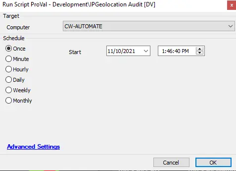

## Summary

This script collects the current location details of a device.

## Sample Run

## Dependencies

- @plugin_proval_ipinfo - Table

## Process

This script scans the device to collect information about its current location. It uses the ipinfo.io website to gather this information, which includes:
- Device IP
- City
- State
- Country
- Map Location
- Postal Address
- Timezone
- Date when the data was collected

## Output

- Script log
- Dataview
- Custom table plugin_proval_ipinfo