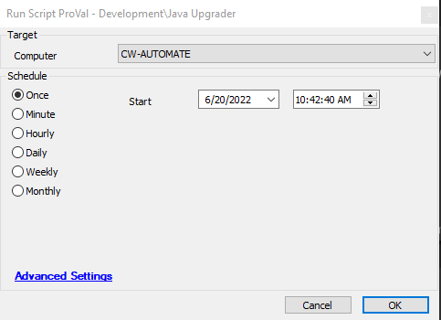

## Summary

This script upgrades Java to the latest version of Java 8.

## Sample Run

## Script State

| Name      | Example        | Description                                        |
|-----------|----------------|----------------------------------------------------|
| Old_Java  | java advance 8 | All old Java application names, separated by commas |

## Process

- Upgrades to the latest version of Java 8.
- Attempts to remove old Java installations.
- Stores old Java information in the Script State just in case.

## Output

- Script log
