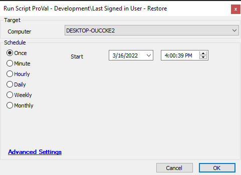

## Summary

This script will restore the backup logon user to the login screen of the machine.

## Sample Run

## Variables

Document the various variables in the script. Delete any section that is not relevant to your script.

| Name          | Description                                               |
|---------------|-----------------------------------------------------------|
| LogonRestore  | This stores information about whether the last logged on user is backed up or not. |

## Process

This script will restore the backup logon user to the login screen of the machine. It first checks for the logon backup file, i.e., 'C:/Temp/Logonbackup/logonexport.reg'. If found, it will restore it on the machine and remove this backup after restoration.

## Output

- Script log

