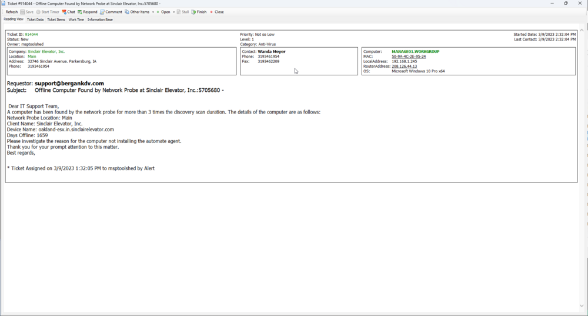

## Summary

This document outlines a method to find all network devices categorized as 'computers' that have been present on the network for more than three days. The maximum frequency for running a network discovery scan is once a day, and it may take up to three scans to successfully attempt to install an agent.

## Target

Global - This method should be run without explicitly defined targets.

## Ticketing

