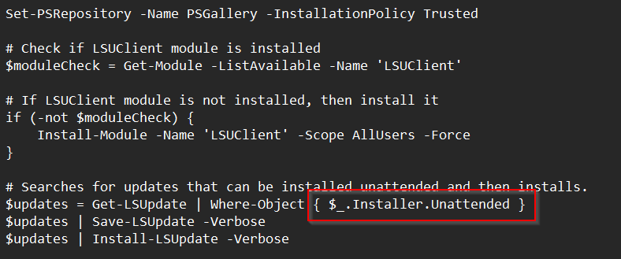

## Summary

Microsoft provides an executable (.exe) file for the new Teams client, allowing you to upgrade the application directly. This executable (TeamsBootStrapper) enables a direct or "bulk" upgrade; users don't need to manually download and install the Teams client.

To install the new Teams client using the TeamsBootStrapper, use the following PowerShell command:

```
Start-BitsTransfer -Source "https://go.microsoft.com/fwlink/?linkid=2243204&clcid=0x409" -Destination "$env:TEMP/teamsbootstrapper.exe" (& "$env:TEMP/teamsbootstrapper.exe" -u -p | ConvertFrom-Json).success
```

## Dependencies

- PowerShell 5.0+

## Output

- Agent Procedure Log  
  `%ProgramData%/_automation/AgentProcedure`

## Parameters

Shared file line 6 is where the .PS1 is deployed.  

  

The red box indicates where the update options are configured.  

  

The script is set to a default of **Installer.Unattended**, which will only install updates that can be completed without a user prompt.

Setting this to the option below will install all updates, but review the warning above.

```
$updates = Get-LSUpdate -All
```

GitHub: [https://jantari.github.io/LSUClient-docs/](https://jantari.github.io/LSUClient-docs/)  
[https://github.com/jantari/LSUClient](https://github.com/jantari/LSUClient)


