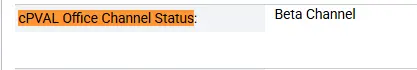

## Summary

This custom field contains the office channel status of the machines.

## Dependencies

- [Office C2R - Get Channel Status](/docs/bf426f89-7da1-4f4b-88b7-03983136458c)
- [Office C2R - Set Channel](/docs/d401a54a-5bff-4d37-8fdf-001220f73fb5)

## Details

| Field Name                  | Type                | Description                                                                       |
| --------------------------- | ------------------- | ------------------------------------------------------------------------------------- |
| cPVAL Office Channel Status | Machine             | Stores the Microsoft Office update channel status detected on the endpoint. |

## Output
Sample image:  

