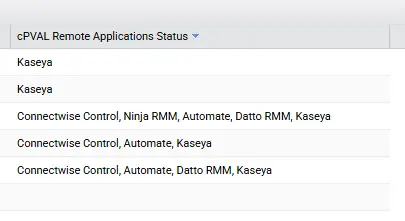

## Summary

Stores detected remote access applications found on the endpoint based on uninstall keys, running processes, services, and known executable paths. Used for auditing and reporting.

## Dependencies

[Script - Get - Remote control Applications](/docs/fb5ec942-3415-43e0-b6b8-bbfeaf222358)

## Details

| Field Name | Type of Field (Machine or Organization) | Description |
| ---------- | --------------------------------------- | ----------- |
| cPVAL Remote Applications Status | Machine | Stores detected remote access applications found on the endpoint based on uninstall keys, running processes, services, and known executable paths. Used for auditing and reporting. |

## Output

