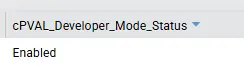

## Summary

This custom field is used to store the data of the developer mode status on the machine.

## Dependencies

- [Agent Procedure: Check Developer Mode Status - CF](/docs/101362d2-15fb-4f85-b344-08986e7e12f3)
- [Solution: Developer Mode Enable Solution](/docs/b4452b00-9dfd-4ad8-b4fd-3ba7769ff674)

## Details

| Field Name | Type of Field | Description |
| ---------- | --------------------------------------- | ----------- |
| cPVAL_Developer_Mode_Status | Machine | Stores the developer mode status |

## Output

## Changelog

### 2026-05-01

- Initial version of the document
