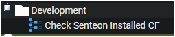
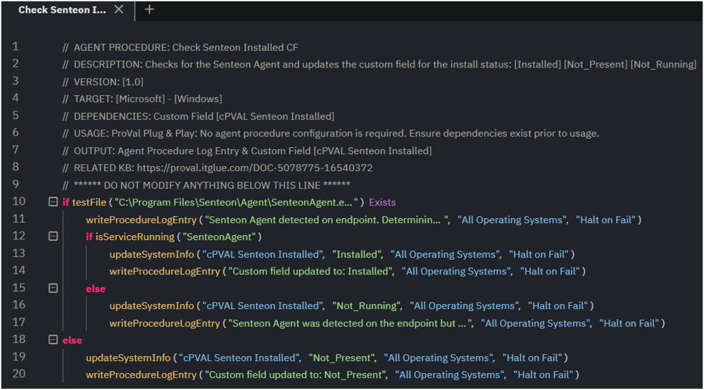
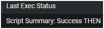
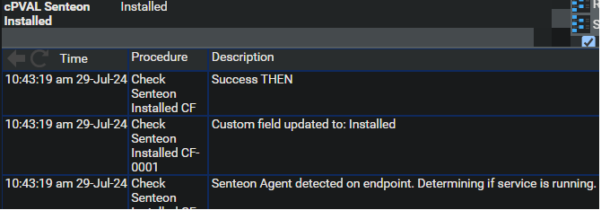
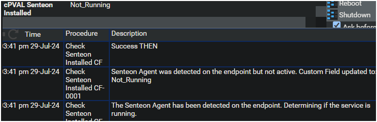
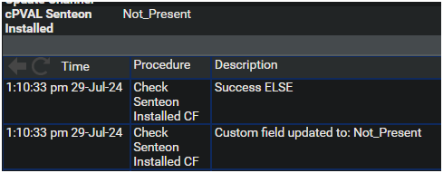

## Summary

This agent procedure is used to check for the presence of the Senteon Agent on the endpoint and updates a custom field **cPVAL Senteon Installed** with the status.

## Dependencies

Custom Field: [cPVAL Senteon Installed](https://proval.itglue.com/DOC-5078775-16540467)

## Associated Content

[SWM - Software Management - Solution - Senteon Agent](https://proval.itglue.com/DOC-5078775-16541168)

## Implementation

Ensure all dependencies exist prior to implementation.  
Export the agent procedure from the ProVal VSA, and import into the partner VSA.  
Name: Check Senteon Installed CF  

  
  

## Output

Agent Procedure Log Entry  

Script Summary of Success is expected  
  

Agent Procedure Log Entry & Custom Field - **Installed**  
  

Agent Procedure Log Entry & Custom Field - **Not_Running**  
  

Agent Procedure Log Entry & Custom Field - **Not_Present**  
  

