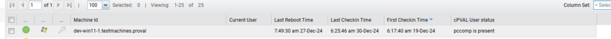

## Summary

This agent procedure checks whether the user "pccomp" exists or not.

## Example Agent Procedure Log

| Timestamp                | Action                                           | Status                      | User              |
|--------------------------|--------------------------------------------------|-----------------------------|-------------------|
| 6:05:39 am 30-Dec-24    | Check User: pccomp                              | Success                     | vaibhav.arora     |
| 6:05:39 am 30-Dec-24    | Check User: pccomp                              | pccomp                      | vaibhav.arora     |
| 6:05:39 am 30-Dec-24    | Execute Shell command - Get Results to Variable  | Success                     | vaibhav.arora     |
| 6:05:37 am 30-Dec-24    | Execute Shell command - Get Results to Variable-0005 | Executing command in 64-bit shell as system: powershell.exe -ExecutionPolicy Bypass -Command "(Get-WmiObject -Class Win32_UserAccount -Filter \"Name='pccomp'\").Name" > "c:/kworking/commandresults-13557768.txt" 2>&1 | vaibhav.arora     |
| 6:05:35 am 30-Dec-24    | Check User: pccomp                              | Checking for the pccomp user | vaibhav.arora     |
| 6:05:27 am 30-Dec-24    | Run Now - Check User: pccomp                    | Admin vaibhav.arora scheduled procedure Run Now - Check User: pccomp to run at Dec 30, 2024, 6:05 AM |                   |

## Dependencies

Custom Field: cPVAL User Status

## Output

Agent procedure log.

