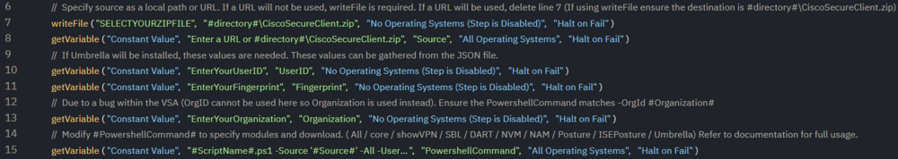
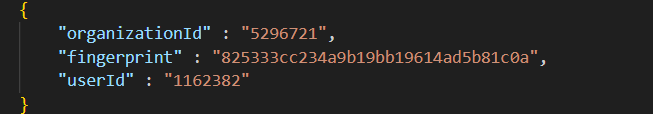

# Overview
This document describes how to install the Cisco Secure Client and selected modules.

# Requirements
For a complete installation or Umbrella installation, the OrgID, UserID, and Fingerprint are required to generate the Umbrella JSON.

# Process
There are a few configurations required for this agent procedure.

This procedure can use a URL or managed files for the installer. If using managed files, ensure line 7 is not disabled, has the location of the ZIP file, and the destination shows **#directory#//CiscoSecureClient.zip**.

If using a URL, enter the URL on line 8.



If Umbrella is required, the Organization ID, Fingerprint, and User ID are necessary. These values can be pulled from the client portal or from the JSON file itself. Enter these values into the variables on lines 10, 11, and 13, and ensure the line is not disabled. If there are multiple sites/orgIDs, these variables can be filled with managed variables.



> Due to a bug within VSA, a variable cannot contain "OrgID," so "Organization" is used on line 13 instead. This results in a difference between the PowerShell command and the variable: `-OrgId #Organization#`.

Line 14 is where the configuration is set for which modules are installed. Several examples are shown below in the payload usage. These examples are what would be used in line 14. The full list of accepted parameters can be found in the parameters section of this document.

# Payload Usage
```
#ScriptName#.ps1 -Source #Source# -Dart -Nvm -Posture
```
This command will install the Diagnostics and Reporting, VPN Posture (HostScan), and Network Visibility Modules.

```
#ScriptName#.ps1 -Source #Source# -core -Umbrella -Dart -Nvm -UserID #UserID# -Fingerprint #Fingerprint# -OrgId #Organization#
```
This command will install the Core VPN module (keeping it hidden from the end-user), Umbrella, Diagnostics and Reporting, and Network Visibility Modules. Because Umbrella is being installed, the UserID, Fingerprint, and OrgID are required.

```
#ScriptName#.ps1 -Source #Source# -core -ShowVPN -Umbrella -Dart -Nvm -UserID #UserID# -Fingerprint #Fingerprint# -OrgId #Organization#
```
This command will install the Core VPN module (visible to the end-user in the system tray icon), Umbrella, Diagnostics and Reporting, and Network Visibility Modules using the local path. Because Umbrella is being installed, the UserID, Fingerprint, and OrgID are required.

```
#ScriptName#.ps1 -Source #Source# -All -UserID #UserID# -Fingerprint #Fingerprint# -OrgId #Organization#
```
This command will install all modules, including Umbrella, which require the UserID, Fingerprint, and OrgID to be provided. It programmatically creates a JSON authentication file for access by the Umbrella module.

# Parameters

| Parameter    | Required | Default | Type   | Parameter Set Members | Description                                                       |
|--------------|----------|---------|--------|-----------------------|-------------------------------------------------------------------|
| All          | False    |         | Switch | All                   | Installs all modules. Requires dynamic parameters.                |
| UserID       | True     |         | String | Dynamic: All, Umbrella| Cisco Client ID: Required for Umbrella and all switches.         |
| Fingerprint  | True     |         | String | Dynamic: All, Umbrella| Cisco Fingerprint: Required for Umbrella and all switches.       |
| OrgID        | True     |         | String | Dynamic: All, Umbrella| Cisco Org ID: Required for Umbrella and all switches.            |
| Core         | False    |         | Switch | Custom                | Installs the Core VPN module.                                    |
| ShowVPN      | False    |         | Switch | Dynamic: All, Core    | Displays the Core VPN module in the system tray icon.            |
| SBL          | False    |         | Switch | Custom                | Installs the Start Before Login module.                           |
| DART         | False    |         | Switch | Custom                | Installs the Diagnostic and Reporting Tool module.                |
| NVM          | False    |         | String | Custom                | Installs the Network Visibility module.                           |
| NAM          | False    |         | String | Custom                | Installs the Network Access Manager module.                       |
| Posture      | False    |         | String | Custom                | Installs the VPN Posture (HostScan) module.                      |
| ISEPosture   | False    |         | String | Custom                | Installs the ISE Posture module.                                  |
| Umbrella     | False    |         | String | Custom                | Installs the Umbrella module. Requires dynamic parameters.       |
| DownloadURL  | True     |         | String | Core, All, Custom     | URL to download the CiscoSecureClient.zip file.                  |
| ARP          | False    |         | Switch | Core, All, Custom     | Hides the modules from Add/Remove programs.                       |
| Lockdown     | False    |         | Switch | Core, All, Custom     | Prevents modification of Cisco Secure Client services. Administrators are not exempt. |

# Output
```
./Install-CiscoSecureClient-log.txt
./Install-CiscoSecureClient-error.txt
```

