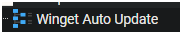
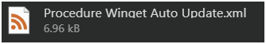
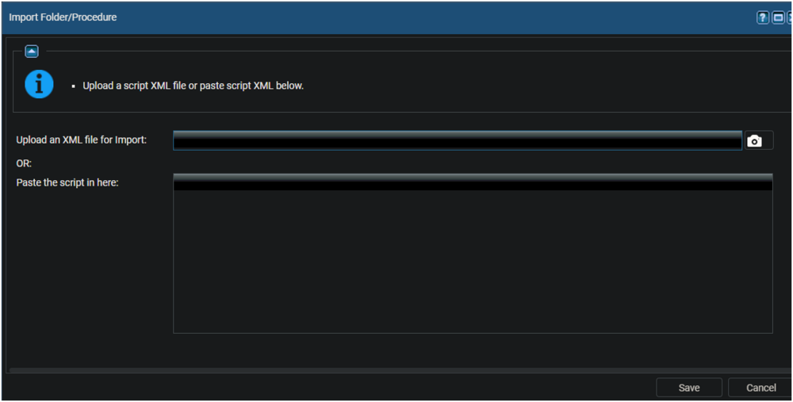
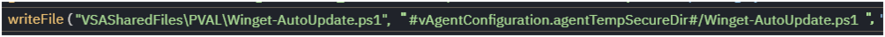
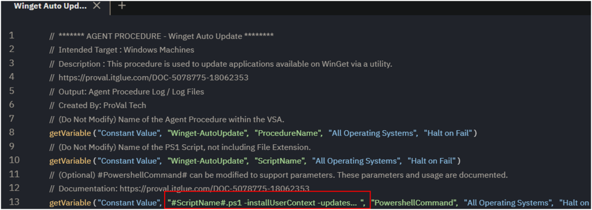
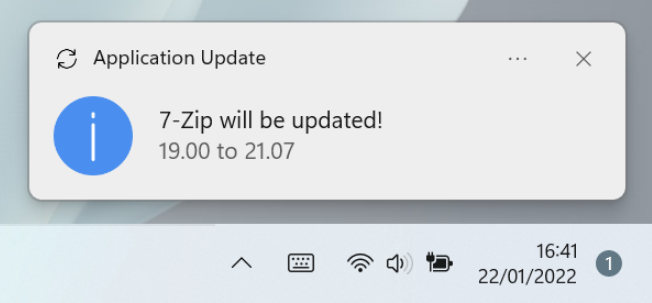

## Summary

This agent procedure is designed to update third party applications available via Winget. 

This solution aims to resolve a common issue with 3rd party applications not being updated, and configures the [Winget-AutoUpdate](https://github.com/Romanitho/Winget-AutoUpdate) solution on the endpoint with the parameters set. This solution has several configurable parameters detailed below.

Refer to [Winget-AutoUpdate](https://github.com/Romanitho/Winget-AutoUpdate) for detailed information on `Winget-AutoUpdate`.

The default for Winget-AutoUpdate is to perform a check daily at 6 AM.

## Implementation

Export the procedure from ProVal's VSA instance  
Name: Winget Auto Update  
  
The export will download the necessary XML file.  
  

Import this procedure into the partner's VSA instance  
  

Upload the PS1 to the partner's VSA. A copy is located in this document in addition to our VSA.  
  

Ensure the procedure is updated to point to the PS1 file uploaded to the partner's VSA.  
  

After selecting the PS1 file, the path will be defaulted back to the Kaseya default.  
`#vAgentConfiguration.agentTempSecureDir#/Winget-AutoUpdate.ps1`  

Ensure the portion on the right reads: `#directory#//#ScriptName#.ps1`  
  

## Usage

The Winget AutoUpdate solution can be configured via the `#PowerShellCommand#` variable.  

As this solution requires an import of a PS1 managed file, it is recommended to configure the `#PowerShellCommand#` variable to match the partner's needs at this time of import.  

  

The default for Winget Auto Update is to:  
- Update System Level Applications  
- Update daily at 06AM  

It is recommended to determine the partner's needs, and adjust this as required. The settings below have been saved in our VSA, and serve as a good basis.  

The following example has been saved in our VSA:  
`#ScriptName#.ps1 -updatesInterval Daily -updatesAtTime 02PM -installUserContext -updatesAtLogon`  
- Update System Level & User Context Application  
- Update daily at 02PM  
- Additionally update at user logon  

## Dependencies

[https://github.com/Romanitho/Winget-AutoUpdate](https://github.com/Romanitho/Winget-AutoUpdate)

## Variables

| Name               | Description                                         |
|--------------------|-----------------------------------------------------|
| procedureName      | Winget-AutoUpdate                                   |
| workingDirectory    | C:/ProgramData/_automation/script/Winget-AutoUpdate |
| ps1Path            | C:/ProgramData/_automation/script/Winget-AutoUpdate/Winget-AutoUpdate.ps1 |

## Parameters

| Name                      | Example                          | Options                                                                 | Description                                                                                                                                                                                                                                       |
|---------------------------|----------------------------------|-------------------------------------------------------------------------|---------------------------------------------------------------------------------------------------------------------------------------------------------------------------------------------------------------------------------------------------|
| -InstallUserContext       | -InstallUserContext              |                                                                         | Add this parameter to enable auto-update for User-level applications. By default, only system-level applications are updated.  **Note:** End users may observe a PowerShell window appearing on their screens during the scheduled update if the user context is enabled. |
| -updatesAtLogon           | -updatesAtLogon                  |                                                                         | Add this parameter to configure WAU to run at user logon. Both UpdatesAtTime and UpdatesAtLogon can be used together.                                                                                                                        |
| -NotificationLevel        | -NotificationLevel None          | Full, SuccessOnly, None                                                | Specifies the notification level for application updates.  **Default:** None  **Sample Notification:**                                                                                      |
| -UpdateInterval           | -UpdateInterval Daily            | Daily, BiDaily, Weekly, BiWeekly, Monthly, Never                       | Specifies the frequency of updates for the applications. This parameter defines how frequently the available updates are checked and implemented for the applications.  **Default:** Daily                                                                             |
| -UpdatesAtTime            | -UpdatesAtTime 06AM              | 12AM, 12:30AM, 01AM, 01:30AM, 02AM, 02:30AM, 03AM, 03:30AM, 04AM, 04:30AM, 05AM, 05:30AM, 06AM, 06:30AM, 07AM, 07:30AM, 08AM, 08:30AM, 09AM, 09:30AM, 10AM, 10:30AM, 11AM, 11:30AM, 12PM, 12:30PM, 01PM, 01:30PM, 02PM, 02:30PM, 03PM, 03:30PM, 04PM, 04:30PM, 05PM, 05:30PM, 06PM, 06:30PM, 07PM, 07:30PM, 08PM, 08:30PM, 09PM, 09:30PM, 10PM, 10:30PM, 11PM, 11:30PM | Specifies the time for updates in 12-hour format for updating the applications.  **Default:** 06AM                                                                                                       |
| -doNotRunAfterInstallation | -doNotRunAfterInstallation       |                                                                         | Add this parameter to prevent Winget-AutoUpdate from running immediately after installation. By default, it runs after installation.                                                                                                                                               |
| -whitelistedApp           | -whitelistedApp Ditto.Ditto, Greenshot.Greenshot, HeidiSQL.HeidiSQL, 7zip.7zip, Python.Python.3.12, Mozilla.Firefox* |                                                                         | A comma-separated list of applications to update. By default, the solution will enable the Auto-update for all applications unless a whitelist is defined. Specifying this list overrides the blacklisted applications.                            |
| -blacklistedApp           | -blacklistedApp Ditto.Ditto, Greenshot.Greenshot, HeidiSQL.HeidiSQL, 7zip.7zip |                                                                         | A comma-separated list of applications to exclude. Only one of Whitelist or Blacklist can be used at a time. If both are provided, Whitelist will take precedence.                                                                                   |
| -Force                    | -Force                           |                                                                         | The agent procedure's default nature is to compare the existing configuration before running the installation. Adding the `Force` parameter will skip the comparison.                                                                                                           |
| -Uninstall                | -Uninstall                       |                                                                         | To uninstall `Winget-AutoUpdate` and wipe its traces add this parameter.                                                                                                                                                                                                                      |

## Output

- Agent procedure logs  
  - C:/ProgramData/_automation/script/Winget-AutoUpdate/Winget-AutoUpdate-log.txt  
  - C:/ProgramData/_automation/script/Winget-AutoUpdate/Winget-AutoUpdate-error.txt  

- Scheduled tasks created under `/WAU/`:  
  - Winget-AutoUpdate  
  - Winget-AutoUpdate-Notify  
  - Winget-AutoUpdate-Policies  
  - Winget-AutoUpdate-UserContext  

## File Hash

**File Path:** `C:/ProgramData/_Automation/script/Winget-AutoUpdate/Winget-AutoUpdate.ps1`  
**File Hash (Sha256):** `DCC8DF84B0145829B31B89BA047A786C42189C4598C4C458E7D575D7DC1985EF`  
**File Hash (MD5):** `07DFAD0A66AA5A4B40C946DF727BE3D8`  

